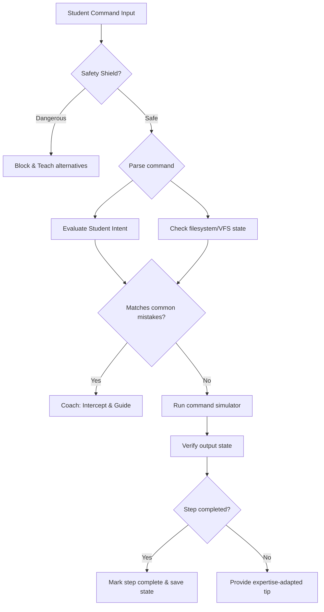

# Cortex AI Mentor System

This document specifies the architecture, logic engines, and teaching scripts for the **Cortex AI Mentor System**. The system shifts the terminal feedback loops from passive command outputs to an active cognitive coaching experience.

---

## 1. Core Architecture

The AI Mentor operates on a **React-Intercept-Scaffold** lifecycle. Instead of allowing standard operating systems errors (like `command not found` or `fatal: branch not found`) to block the user, the mentor intercepts inputs and states to build custom educational cards.



---

## 2. Mistake Classification Matrix

The coach evaluates errors across three main levels: typo level, process level, and conceptual level.

| Input Command | Detected Misconception / Mistake | AI Mentor Intervention Scaffolding |
| :--- | :--- | :--- |
| `git push` | Trying to push changes to GitHub before staging and committing. | **Process coaching:** "You're trying to push changes, but Git doesn't have any saved snapshots to upload. Let's do this first: 1. `git add .` to stage, 2. `git commit -m 'msg'` to commit." |
| `cd exercises.ts` | Confusing a file with a folder directory. | **File system teaching:** "You tried to `cd` (Change Directory) into a file. You can only enter folders. To view files, try running: `cat exercises.ts` or editing it with `nano exercises.ts`." |
| `npm run dev` | Running the server before npm packages are installed. | **Environment tutoring:** "Vite could not start because packages are missing. Run `npm install` first to download dependencies into `node_modules/`." |
| `git checkout main` | Switching branch with uncommitted changes that might get lost. | **Safety check:** "Wait! You have staged changes in your working tree. Switching branches now might conflict. Try stashing them first with `git stash`, or commit them." |

---

## 3. Cognitive Scaffolding Mechanics

The mentor ensures students are guided step-by-step rather than given the answer immediately. When a student makes repeated errors, SARA increases details across three levels:

### Level 1: The Gentle Spark (Friction point identified)
> 💡 *Check the arguments of `git commit`. Did you write the message flag `-m`?*

### Level 2: The Functional Analogy (Mental model correction)
> 🧩 *In Git, committing is like taking a snapshot of your project's files. The `-m` flag lets you write a description labels on that photo, so you know what changed later.*

### Level 3: The Complete Formula (Practical resolution)
> 🔧 *To commit files, type this exactly:*
> `git commit -m "Your descriptive message"`

---

## 4. Student Confusion & Frustration Signals

The terminal listens for behavioral patterns that signal confusion:
- **Repetitive Command Looping**: Running the exact same incorrect command 3+ times in a row.
- **Rapid Typos**: Typing nonsense commands repeatedly in under 5 seconds.
- **Stagnant Inactivity**: 45 seconds passing with a mission step active without any inputs.

When these are triggered, SARA automatically prints a conversational offer in the log console:
> *"Hi scholar! It looks like this step is a bit tricky. Would you like me to explain the concept in the sidebar, or should we reset this exercise to try it together?"*
> **[Explain in Chat]** **[Reset Step]**

---

## 5. Implementation Specifications

The logic is built inside [terminalIntelligence.ts](file:///Users/lokeshgandreddy/Sara/Vidhyalaya/frontend/src/utils/terminalIntelligence.ts) using the `formatMistakeResponse` and `detectIntent` frameworks:

```typescript
export const detectProcessMistakes = (input: string, gitState: GitRepo): string[] | null => {
  const cmd = input.trim().toLowerCase();

  if (cmd.startsWith('git push')) {
    const hasCommits = gitState.commits.length > 0;
    const hasStaged = gitState.files.some(f => f.status === 'staged');

    if (!hasCommits && hasStaged) {
      return [
        "⚠️ process roadblock detected!",
        "You are trying to push changes, but your repository has no commits yet.",
        "To fix this, commit your staged files first:",
        "  git commit -m \"Your message\"",
        "Then push again."
      ];
    }
  }
  return null;
};
```
This keeps mistake handling grounded in actual code structures, keeping responses targeted and educational.
