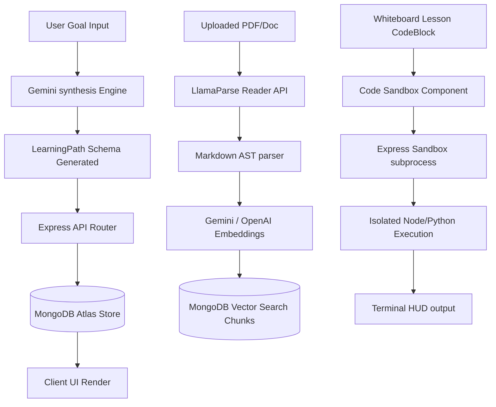

# Architecture & Design Manual

This document provides a technical guide to the architectural patterns, directory structure, data flows, and design systems of **Vidhyalaya**.

---

## 1. Directory Structure & Separation of Concerns

Vidhyalaya is a monorepo-style application split into a React frontend client and an Express.js backend API server.

```text
/ (root)
├── backend/
│   ├── src/
│   │   ├── config/        Database (Mongoose) and vector RAG store settings
│   │   ├── middleware/    JWT authentication, rate limiters, tenant isolation guards
│   │   ├── models/        Mongoose schemas (LearningPath, UserProfile, ModuleContent)
│   │   ├── routes/        Express API controllers and endpoint routes
│   │   ├── services/      AI prompt executors, video web scraping, code sandboxes
│   │   └── utils/         Logger (Pino), mailer (Nodemailer), timing-safe checks
│   └── package.json
├── frontend/
│   ├── src/
│   │   ├── components/    Shared UI modules, Layouts, Terminal HUD, Code Sandbox
│   │   ├── context/       Zustand global store (Store.tsx) and Focus context
│   │   ├── features/      Concept maps, video players, tutoring panels (SARA)
│   │   ├── pages/         Main application routes (Dashboard, StudySession, etc.)
│   │   ├── services/      API connectors, Gemini generators, soundscape managers
│   │   ├── utils/         Simulated terminal parsers, virtual git filesystem
│   │   ├── types.ts       Unified TypeScript domain definitions
│   │   └── index.css      Sky-blue ice aurora gradients and design tokens
│   └── package.json
└── docs/                  Historical design logs and architectural history
```

---

## 2. Core Architectural Pipelines

Vidhyalaya operates on three primary core engines:



### A. Learning Path Synthesis & Persistence
1.  **Goal Capture**: The user enters a learning target (e.g., "Master React Performance Hooks") and provides optional PDFs or web resources.
2.  **AI Synthesis**: `frontend/src/services/geminiService.ts` dispatches a prompt to Gemini. All generation tasks are throttled by `apiQueue` (1.5s delay, 120s timeout) to prevent rate limits.
3.  **Content Separation**: To prevent document size growth in Mongoose, the schema isolates the roadmap skeleton (`LearningPath.js`) from the detailed chapter content (`ModuleContent.js`).
4.  **Optimistic Rendering**: The client Zustand store (`Store.tsx`) renders the generated path skeleton immediately, dispatching background sync calls to the backend Express server.

### B. Ingest-to-Query RAG Pipeline
1.  **File Upload**: The user uploads educational documents (PDF, Markdown).
2.  **LlamaParse Ingestion**: The Express server uploads the file to LlamaCloud via `LlamaParseReader` to convert tables and diagrams into clean markdown.
3.  **Vector Embeddings**: Chunks are processed through `MarkdownNodeParser` and embedded using OpenAI Embeddings or Gemini Embeddings (BYOK-configured).
4.  **Vector Storage**: Vectors are persisted into MongoDB Atlas Vector Search.
5.  **Grounding Query**: During tutoring sessions, user queries are matched against vector indices, returning context snippets that are appended to SARA prompts.

### C. Cortex Sandbox & Simulated Git
1.  **Code block Isolation**: Markdown lessons rendered in `ContentRenderer.tsx` identify code syntax blocks, appending a floating "Run in Sandbox" button.
2.  **Isolated Execution**: Code is sent to the backend sandbox runner (`backend/src/utils/codeRunner.js`) where it executes inside isolated subprocesses with read/write constraints.
3.  **Virtual Git Filesystem**: A full browser-side mock git architecture (`virtualGit.ts`) allows users to run simulated `git add`, `git commit`, and branch operations inside `ShellTerminal.tsx`.

---

## 3. Design System: Academic Modernism

We follow the "Academic Modernism" design philosophy, prioritizing visual harmony, readability, and calm motion:

*   **Global Background**: Sky-Blue Ice gradient (`linear-gradient(135deg, #eef5ff 0%, #e2ecfc 100%)`) declared in `index.css`.
*   **Surface Contrast**: Content containers, dashboard grids, and workspace blocks utilize solid white (`#ffffff`) surfaces with soft borders.
*   **Kinetic Physics**: Hover micro-interactions and workspace resizing use spring physics via Framer Motion (`type: "spring"`).
*   **Zen Focus Modes**: Study sessions can toggle Zen Mode, shifting the interface into a cinematic dark style (`bg-[#05070a]`), hiding widgets to prioritize active recall.
