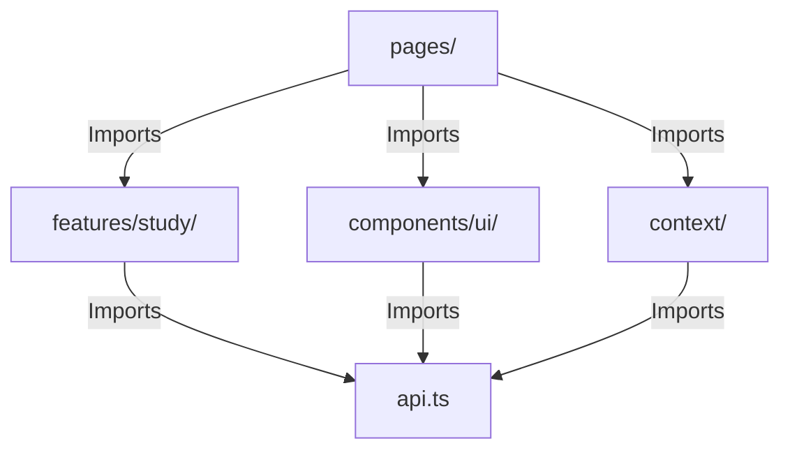

# Architecture Audit (ARCHITECTURE_AUDIT.md)

This report details an architectural audit of Vidyal.ai, evaluating folder conventions, feature isolation, dependency flow, state ownership, and boundary violations.

---

### 1. Folder Structure & Feature Boundaries

#### Current Folder Layout
*   **Frontend (`frontend/src/`)**: Organized into `pages/` (views), `features/` (only contains `study/`), `components/` (divided into `layout/` and `ui/`), `context/` (state engines), and `services/` (external connections).
*   **Backend (`backend/src/`)**: Structured using the standard Model-View-Controller design pattern (`config/`, `models/`, `routes/`, `middleware/`, `services/`).

#### Boundary Anomalies & Violations
1.  **Portfolio Subproject Bleed**:
    *   **File Path**: [frontend/src/portfolio/](file:///Users/lokeshgandreddy/Sara/Vidhyalaya/frontend/src/portfolio/)
    *   **Assessment**: Contains an entire subproject (landing page, resume viewer, personal project links) complete with its own nested folders (`components/`, `pages/`, `config/`, `context/`, `hooks/`, `lib/`, `theme/`) and style overrides (`portfolio.css`, `theme.css`).
    *   **Violation**: Bypasses the boundary of a single unified product codebase. It increases compilation size and creates cognitive load for new developers.
2.  **Primitive UI Folder Pollution**:
    *   **File Path**: [frontend/src/components/ui/](file:///Users/lokeshgandreddy/Sara/Vidhyalaya/frontend/src/components/ui/)
    *   **Assessment**: Hosts massive development features (like [CodeSandbox.tsx](file:///Users/lokeshgandreddy/Sara/Vidhyalaya/frontend/src/components/ui/CodeSandbox.tsx) - 140 KB, [ShellTerminal.tsx](file:///Users/lokeshgandreddy/Sara/Vidhyalaya/frontend/src/components/ui/ShellTerminal.tsx) - 72 KB, and [InteractiveWhiteboard.tsx](file:///Users/lokeshgandreddy/Sara/Vidhyalaya/frontend/src/components/ui/InteractiveWhiteboard.tsx) - 70 KB).
    *   **Violation**: A primitive UI directory should contain only generic, stateless inputs (such as Buttons, Checkboxes, Dialogs). Placing complex components here limits reusability.
3.  **Backend Script Pollution**:
    *   **File Path**: [backend/](file:///Users/lokeshgandreddy/Sara/Vidhyalaya/backend/) root directory.
    *   **Assessment**: Hosts 9 development test files (`checkDb.js`, `testQuota.js`, `testRetriever.js`, etc.).
    *   **Violation**: Development utilities should reside in `backend/src/scripts/` to keep the root directory clean.

---

### 2. Dependency Flow Analysis



#### Directional Review
*   **Correct Flow**: High-level layers (pages) depend on mid-level layers (features/components), which depend on low-level layers (services, context, types).
*   **Circular Dependency Check**: The codebase does not exhibit circular compile-time loops. However, there is tight coupling:
    *   `Store.tsx` imports the REST API client `api.ts` directly to initialize profiles and paths:
        ```typescript
        import { api } from '../services/api';
        ```
    *   If `api.ts` fails or times out during initialization, it blocks the store context hydration, leading to a frozen loading spinner for the user.

---

### 3. State Ownership & Context Usage

The frontend runs three global contexts:
1.  **AppContext (`Store.tsx`)**: The global store for paths, achievements, and profiles.
2.  **FocusContext (`FocusContext.tsx`)**: Manages Pomodoro timing counts.
3.  **SmartStudyContext (`SmartStudyContext.tsx`)**: Classroom smartboards inputs.

#### Architectural Violations
*   **The Context Re-render Bottleneck**:
    *   `Store.tsx` packages state into a single value object.
    *   Any update (e.g. updating path details, modifying notes, earning XP) updates the context object reference.
    *   Consequently, **every component in the application subscribing to `useAppStore` is forced to re-render**, even if it only depends on a static property like `isAuthenticated` or `activePathId`.
*   **State Leakage in Pages**:
    *   In [StudySession.tsx](file:///Users/lokeshgandreddy/Sara/Vidhyalaya/frontend/src/pages/StudySession.tsx), local states for notes editing, AI chatbot interactions, and keyboard synthesizers are declared at the page level.
    *   This clutters the component and prevents individual sub-modules from being tested in isolation.

---

### 4. Service Layer Separation of Concerns

*   **UI Concerns in Services**:
    *   `geminiService.ts` contains raw API interaction logic. However, it also includes functions like `triggerBackgroundPreGeneration` which manages asynchronous pre-generation queues for modules.
    *   This blends low-level API clients with client-side state flow control, which should instead be managed by hooks or state stores.
*   **Service Coupling**:
    *   `api.ts` implements interceptors to check tokens, but is also coupled with local storage. It reads `localStorage.getItem('token')` on every call, mixing infrastructure networking with client storage.
