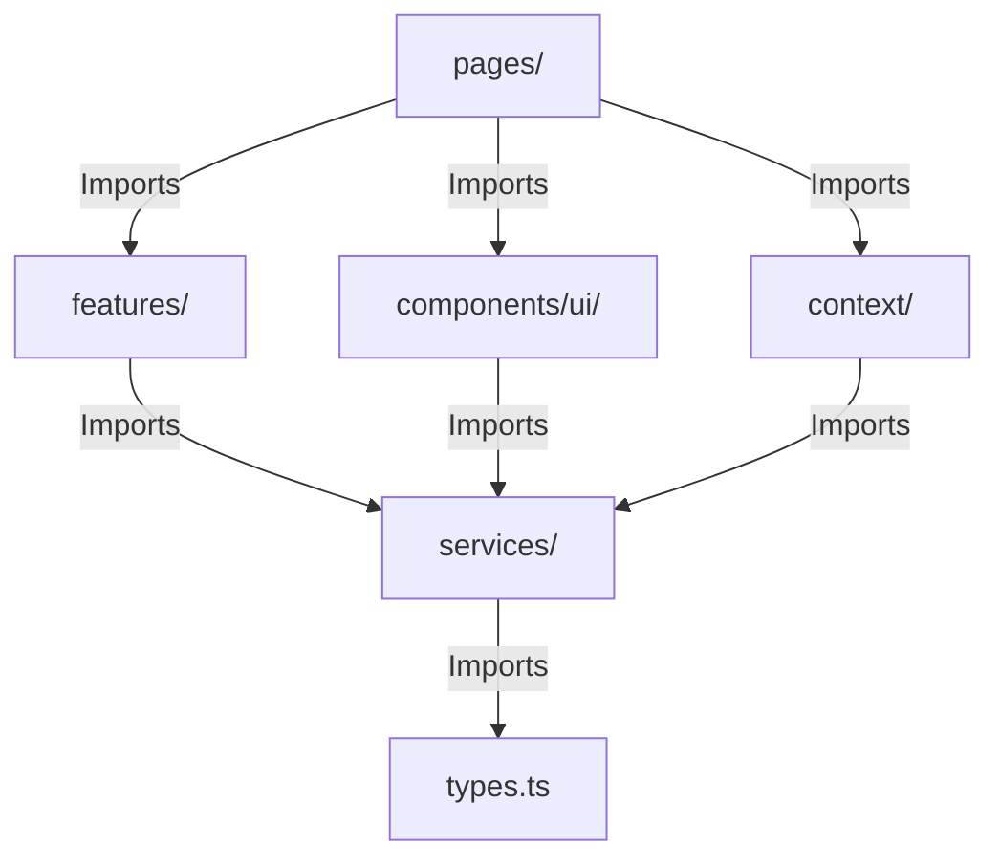

# Architecture Review (ARCHITECTURE_REVIEW.md)

This document provides a comprehensive audit of the system architecture, folder organization, boundary constraints, and data-flow directions of Vidyal.ai.

---

### 1. Folder Organization & Feature Isolation

#### Current Assessment
The folder structure follows a hybrid layout between feature-based and layer-based organization.
*   **Root Folder**: `/frontend/src/`
    *   `features/`: Intended for domain-specific features, but contains only a single folder: `study/`.
    *   `pages/`: Hosts 17 routed views of varying sizes, containing core layout logic, rendering patterns, and business logic.
    *   `components/`: Reusable components, divided into `layout/` and `ui/`.
        *   *Violation*: Components inside `components/ui/` (e.g. [CodeSandbox.tsx](file:///Users/lokeshgandreddy/Sara/Vidhyalaya/frontend/src/components/ui/CodeSandbox.tsx) - 140 KB, [ShellTerminal.tsx](file:///Users/lokeshgandreddy/Sara/Vidhyalaya/frontend/src/components/ui/ShellTerminal.tsx) - 72 KB, [InteractiveWhiteboard.tsx](file:///Users/lokeshgandreddy/Sara/Vidhyalaya/frontend/src/components/ui/InteractiveWhiteboard.tsx) - 70 KB) are heavily specialized educational tools with massive internal states, rather than generic design-system UI primitives (like buttons, dialogs, inputs). They belong in specialized feature subdirectories.
    *   `portfolio/`: An isolated personal sub-project (LandingPage, ResumePage) nested directly in the frontend workspace. It includes duplicate directory abstractions (`portfolio/components/`, `portfolio/config/`, `portfolio/pages/`, etc.), violating modular design boundaries.

#### Recommended Layout
We recommend moving from this mixed structure to a clean, isolated **Feature-Driven Architecture**:
```
frontend/src/
├── components/           # Strictly shared, generic primitives (buttons, inputs, skeleton loaders)
├── context/              # App-wide global context engines (Store, Theme)
├── features/             # Isolated domain features
│   ├── study/            # Flashcards, concept map renderer, whiteboard, sandbox, vault
│   ├── terminal/         # Shell terminal components and custom command hooks
│   └── portfolio/        # Static pages (separated from learning engine routes)
├── hooks/                # Global generic hooks (e.g., useLocalStorage, useDebounce)
├── pages/                # Clean routing views (layout-only, delegating to features)
├── services/             # Low-level infrastructure clients (api, gemini)
└── types/                # Unified type definitions
```

---

### 2. Separation of Concerns & Boundary Violations

#### Client UI vs. Business Logic
There is a consistent bleed of service integrations, networking, caching, and database sync hooks directly into the visual layout component files.
*   **Case Study**: [StudySession.tsx](file:///Users/lokeshgandreddy/Sara/Vidhyalaya/frontend/src/pages/StudySession.tsx)
    *   It contains raw imports to Gemini GenAI services, soundscape synthesis, markdown parsers, local storage draft-saving routines, and native Web Audio oscillators (`KeyboardSynth`).
    *   It mixes UI render trees with specific API payload definitions and error boundaries.
    *   This forces the component to own three responsibilities: Presentation, API integration, and Client Session State.

#### Recommended Boundary Enforcement
*   **Service Layer Separation**: Network operations must be strictly contained inside the `services/` directory. Pages and components should access services through custom hooks (e.g., `useStudyModuleContent` or `useTutorChat`) rather than raw service client imports.
*   **Sub-Component Extraction**: Inline classes and child components (e.g. `KeyboardSynth` and `FlippingRecallCard` inside `StudySession.tsx`) must be separated into their own modules under `features/study/`.

---

### 3. Dependency Direction



#### Rule of Dependency Direction
*   **Correct Flow**: Higher-level modules (pages) depend on lower-level modules (features, components, services, types). Lower-level components must never import pages or root routing maps.
*   **Analysis of Vidyal.ai**: Generally, the dependency direction is maintained. Services and types represent the lowest-level layers. However, the store `Store.tsx` imports the API service client directly, creating a tight coupling. If the API layer throws an unhandled client error or experiences token expiration, it halts the store initialization context.

---

### 4. Context Usage & State Ownership

We have three contexts running globally:
1.  **Store (AppContext)**: Manages learning paths, active profiles, achievements, and cloud synchronizations.
2.  **FocusContext**: Manages active focus session ticks and timer parameters.
3.  **SmartStudyContext**: Manages virtual vault state and smart board inputs.

#### Architectural Concerns
*   **Context Bloat**: `Store.tsx` handles too many responsibilities (path CRUD operations, session updates, achievement checks, profile updates). Any modification to any property of the AppState triggers a re-render in all components subscribing to `useAppStore()`.
*   **State Colocation**: Local page states (e.g. dynamic canvas coordinates in `ConceptMapRenderer.tsx` and active code in `CodeSandbox.tsx`) are often declared locally, but occasionally sync back to the global store via optimistic API writes. This causes visual lag because the UI waits for React state resolution, which is tightly bound to network handlers.

#### Recommended Strategy
*   **Split Contexts**: Split `Store.tsx` into specialized sub-context engines: `PathContext` (paths, modules, sessions) and `ProfileContext` (achievements, levels, XP).
*   **Optimistic UI Interceptors**: Introduce an in-memory client-side cache that updates immediately and handles background persistence queueing, reducing UI redraw dependency on network responses.
