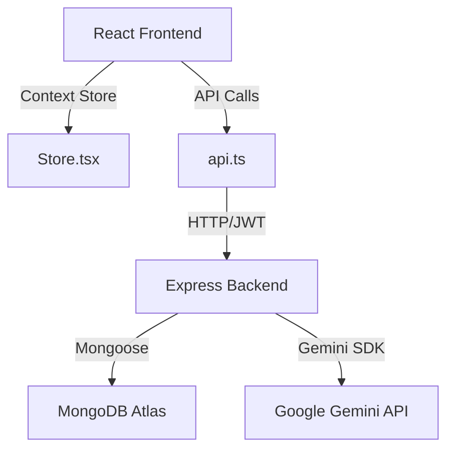

# Codebase Audit Report (CODEBASE_AUDIT.md)

This report details the architectural components, structures, data flows, and configuration layers of the Vidyal.ai codebase.

---

### 1. Project Overview

Vidyal.ai is an adaptive personalized learning path platform. It leverages AI models (Google Gemini) to transform unstructured topics into structured paths, modules, quizzes, and visualizations.

*   **Frontend**: React 19 + TypeScript + Vite.
*   **Backend**: Node.js + Express + MongoDB Atlas + Gemini GenAI SDK.
*   **Styling**: Tailwind CSS v4.

---

### 2. Architecture Overview

The system operates as a unified client-server application. The frontend uses a client-side global store for state and manages local UI modifications. The backend exposes REST routes to read and write database structures and invoke the Gemini API.

---

### 3. Folder Structure Analysis

#### Frontend (`frontend/src/`)
*   `components/`: Reusable widgets. Splits into `ui` (interactive controls) and `layout` (outer chrome).
    *   *Issue*: Mixing file extensions. The folder contains `command.jsx` and `dialog.jsx` alongside typescript files.
*   `context/`: Context stores. Includes `Store.tsx` (the central state engine), `FocusContext.tsx`, and `SmartStudyContext.tsx`.
*   `features/`: Sub-modules. Only includes `study/` (bibliography, flashcards, concept maps, quizes).
*   `hooks/`: Shared hooks. Only contains `useFocusSession.ts`.
*   `services/`: Communication layer. Includes `api.ts` (REST endpoints), `geminiService.ts` (LLM prompts), `soundscapeService.ts`, and `videoLibrary.ts`.
*   `pages/`: Routed views. Contains 17 files corresponding to dashboard tabs, path creations, and study layouts.
*   `portfolio/`: Standalone personal views (`LandingPage`, `ResumePage`) which clutter the app workspace.
*   `styles/`: CSS assets (`CodeSandbox.css` animations).

#### Backend (`backend/src/`)
*   `config/`: Databases and vector configs (`db.js`, `ragConfig.js`).
*   `middleware/`: Authentication checks (`auth.js`).
*   `models/`: Mongoose schemas (`LearningPath.js`, `Document.js`, etc.).
*   `routes/`: Express endpoint trees mapping to resource types.
*   `services/`: Core logic and third-party API handlers (`chatService.js`, `videoCurationService.js`).
*   *Issue*: Backend root directory is cluttered with one-off debug scripts (`testQuota.js`, `testEmbed.js`, `queryDb.js`, etc.) which should reside in a `scripts/` folder.

---

### 4. Data Flow Analysis

1.  **Mounting / Hydration**: The app mounts -> `Store.tsx` runs `useEffect` -> calls `api.getUserProfile()` and `api.getUserPaths()` -> updates React state -> renders dashboard.
2.  **Optimistic Modifications**: User completes a module -> `updateModuleStatus` runs -> updates local state array -> calls `api.updatePath()` asynchronously (fire-and-forget).
3.  **LLM Generation Flow**: User requests path -> clicks Create -> triggers `geminiService.ts` request -> backend streams JSON structures -> frontend updates paths state -> navigates to `/path/:id`.

---

### 5. State Management Analysis

*   **Global Store**: Managed in `Store.tsx` via `AppContext` and exposed through the `useAppStore` hook. It handles paths, user profiles, achievements, and active path IDs.
*   **Local State**: Scattered extensively within large page views (such as `StudySession.tsx` and `CodeSandbox.tsx`), leading to uncoordinated state boundaries.
*   **Sync Status**: A failsafe timer of 5 seconds blocks infinite load stutters if backend synchronizations stall.

---

### 6. API Layer Analysis

*   Managed in `frontend/src/services/api.ts`.
*   An authorization interceptor (`fetchWithAuth`) retrieves tokens dynamically from the `/auth/token` backend via JWT signature keys. It binds the bearer token header (`Authorization: Bearer <token>`) to every call.
*   API methods wrap request body serializations and throw on non-2xx responses.

---

### 7. UI Layer Analysis

*   The layout is wrapped in `Layout.tsx` (sidebar, top bar, content panels).
*   Monospaced typography, dark hex backgrounds (`#161616`), and emerald outlines create a premium terminal feel.
*   Heavy visualizations (e.g. `ConceptMapRenderer.tsx` using custom canvas vectors) run in the viewport.

---

### 8. Infrastructure Analysis

*   **Build tool**: Vite + ESBuild.
*   **Database**: MongoDB Atlas via Mongoose ORM.
*   **Deploy Configuration**: Driven by local `.env` and `.env.local` files pointing to Port 5001 for APIs.
