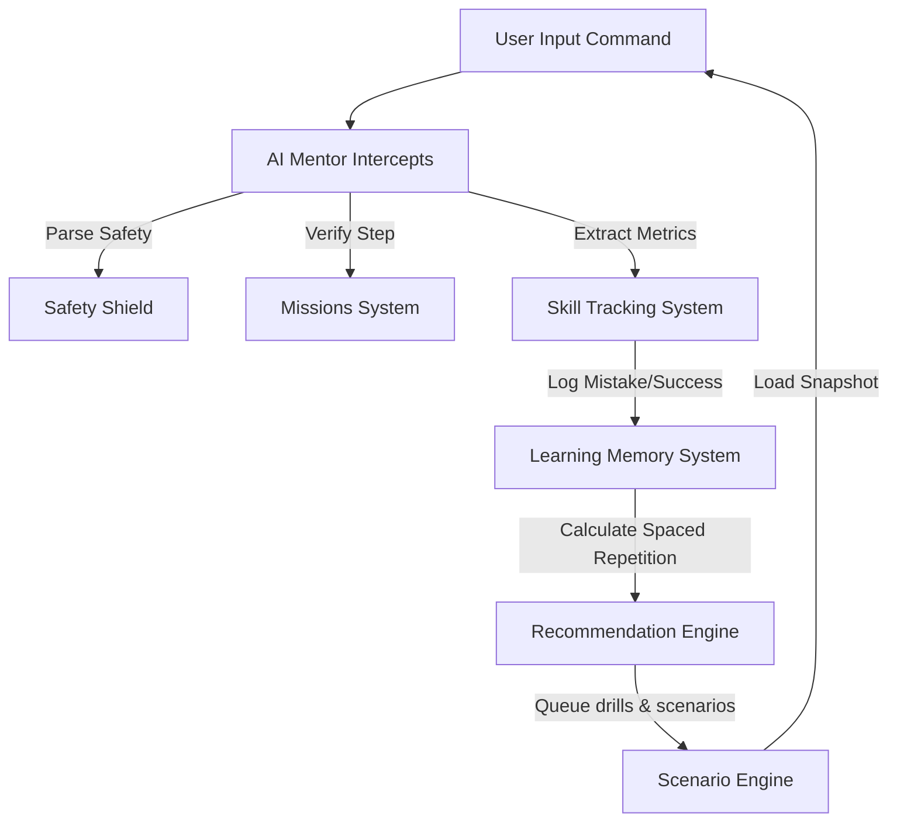

# Cortex AI Coding Coach Master Plan

This document presents the overarching architectural blueprint, learner personas, integration pathways, and development roadmap to transform the Cortex Terminal into a personalized **AI Coding Coach**.

---

## 1. Executive Summary & Vision

The terminal is not a developer utility; it is a learning medium. The goal of the Cortex AI Coding Coach is to convert the terminal from a syntax-checking command line into a supportive, active educational mentor.

Instead of showing standard shell errors, the coach intercepts, analyzes, scaffolding-explains, and dynamically recommends practice scenarios based on cognitive memory mapping.

---

## 2. Integrated System Architecture

The AI Coding Coach is powered by five interconnected modules. The diagram below illustrates how commands flow through the cognitive evaluation loop:



All detailed systems are specified across the codebase:
1. **Mission Schema**: [LEARNING_MISSIONS_SYSTEM.md](file:///Users/lokeshgandreddy/Sara/Vidhyalaya/LEARNING_MISSIONS_SYSTEM.md)
2. **AI Interceptions**: [AI_MENTOR_SYSTEM.md](file:///Users/lokeshgandreddy/Sara/Vidhyalaya/AI_MENTOR_SYSTEM.md)
3. **Skill Analytics**: [SKILL_TRACKING_SYSTEM.md](file:///Users/lokeshgandreddy/Sara/Vidhyalaya/SKILL_TRACKING_SYSTEM.md)
4. **Spaced Repetition Memory**: [LEARNING_MEMORY_SYSTEM.md](file:///Users/lokeshgandreddy/Sara/Vidhyalaya/LEARNING_MEMORY_SYSTEM.md)
5. **Interactive Sandboxes**: [SCENARIO_ENGINE.md](file:///Users/lokeshgandreddy/Sara/Vidhyalaya/SCENARIO_ENGINE.md)
6. **Workspace Layout**: [SESSION_LEARNING_INTEGRATION.md](file:///Users/lokeshgandreddy/Sara/Vidhyalaya/SESSION_LEARNING_INTEGRATION.md)

---

## 3. Core Learner Personas

### Maya — The Absolute Beginner
* **Goal**: Learn Python and Git basics for college.
* **Friction Points**: Terrified of command lines; typos trigger panic; doesn't understand directory structures.
* **Coach Experience**: Automatic typo corrections; Level 3 (complete formula) hints; friendly conversational interventions on stagnant inactivity.

### Alex — The Version Control Struggler
* **Goal**: Learn collaborative Git workflows.
* **Friction Points**: Constantly runs into dirty checkouts and git push conflicts; manually copies folders instead of branch merging.
* **Coach Experience**: AI intercepts dirty checkouts, explains Git as snapshots, guides him step-by-step through conflict resolution sandboxes.

---

## 4. Architectural Specs Cheat-Sheet

| System Component | Primary Responsibility | Critical Data Handled |
| :--- | :--- | :--- |
| **Missions System** | Evaluates steps vs active status | Step completion boolean, active tracking target. |
| **AI Mentor** | Intercepts errors, scales scaffolding | Mistake classification, SARA dialogue cards. |
| **Skill Tracker** | Measures mathematical competence | Category score, sub-skill metrics, decay. |
| **Learning Memory** | Space-repetition schedules | Concept strength ($S$), retention level ($R_t$). |
| **Scenario Engine** | Sandboxes broken states | Isolated VFS snapshot, restore backup state. |
| **UI Integration** | Renders bottom drawer and HUD overlay | Framer motion drawer height, active banner HUD. |

---

## 5. Engineering Phase Roadmap

```text
  Phase 1: Foundation ──────► Phase 2: Specifications ──────► Phase 3: Engine Builds ──────► Phase 4: Visual Polish
      (Completed)                  (Completed)                 (Next Up: June 2026)             (Next Up: July 2026)
```

### Phase 1: Foundation (Completed)
- Completed basic VFS and Git command simulator structures.
- Added sliding bottom terminal panel component.

### Phase 2: Specifications (Completed)
- Drafted all system specifications to create a unified system map.
- Aligned schemas, math formulas, and interface layouts.

### Phase 3: Engine Builds (Next Up)
- Implement `terminalIntelligence.ts` parsing methods for cognitive scaffolding.
- Build the `ScenarioSession` switcher and memory-state sync to MongoDB.

### Phase 4: Visual Polish
- Add Framer Motion drawer dragging handles.
- Integrate custom interactive helpers and SVG skill radar charts.
