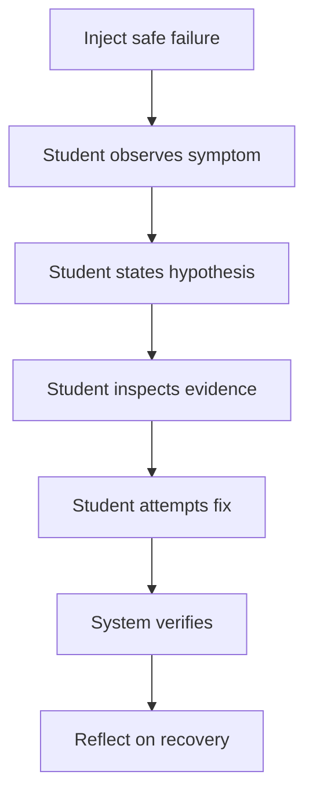

# Failure Engine

## Purpose

The Failure Engine deliberately teaches recovery. Great engineers are not people who avoid failure. They are people who can diagnose, recover, and learn from it.

Confidence comes from recovery, not success.

## Failure Types

### Bugs

- Incorrect UI state.
- Broken calculation.
- Missing render update.
- Wrong conditional logic.

### Runtime Errors

- Undefined variable.
- Network failure.
- Missing package.
- Async rejection.

### Wrong Assumptions

- Assuming a file exists.
- Assuming current branch is correct.
- Assuming API URL is configured.
- Assuming state updates synchronously.

### Git Mistakes

- Push before commit.
- Commit without staging.
- Merge conflict.
- Detached or wrong branch.
- Deleted file recovery.

### Logic Errors

- Off-by-one.
- Mutating state.
- Incorrect boolean condition.
- Race condition.

### Debugging Scenarios

- No stack trace.
- Misleading error.
- Multiple possible causes.
- Works locally, fails elsewhere.

## Failure Loop



## Mentor Rules

SARA should ask before telling:

- What do you notice?
- What changed recently?
- What is the smallest thing you can inspect?
- What would prove your hypothesis wrong?

SARA should intervene faster if:

- The student is looping.
- The student is making unsafe changes.
- The student is emotionally stuck.
- The student has no viable next action.

## Failure Difficulty Ladder

### Level A: Visible Failure

The error message is direct.

### Level B: Hidden Cause

The symptom is visible but cause requires inspection.

### Level C: Misleading Signal

The first obvious cause is not the real cause.

### Level D: Multi-System Failure

Cause spans code, terminal, browser, and configuration.

### Level E: Ambiguous Production Issue

Requires prioritization, communication, and tradeoff reasoning.

## Recovery Evidence

Record:

- Symptom recognized.
- Hypothesis quality.
- Inspection commands used.
- Fix attempt count.
- Help level required.
- Whether student explained root cause.

## Product Goal

Students should eventually say:

```text
Errors do not scare me. They give me information.
```
