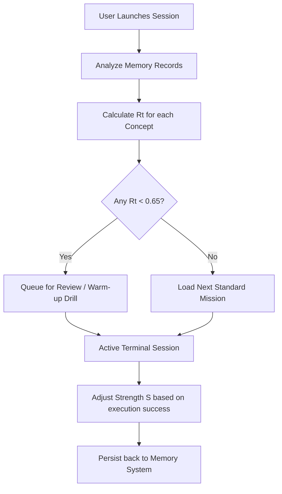

# Cortex Learning Memory System

This document specifies the design, scheduling algorithms, and data schemas for the **Cortex Learning Memory System**. The system simulates a "cognitive twin" of the learner, modeling their retention curves and past friction points to personalize study sessions over multiple days.

---

## 1. Spaced Repetition & Forgetting Curve Engine

To prevent syntax and workflows from being forgotten (the "Forgetting Curve"), Cortex calculates an **Interval Retention Score ($R_t$)** for every terminal command or concept:

$$R_t = e^{-\frac{t}{S}}$$

Where:
* **$t$**: Elapsed time (in hours) since the command was last successfully executed.
* **$S$ (Strength of Memory)**: The current durability of the concept. $S$ increases with successful reviews and decreases on repeated mistakes:

$$S_{new} = \begin{cases}
      S_{old} \cdot (1.5 + 0.1 \cdot \text{successCount}) & \text{if Success} \\
      S_{old} \cdot 0.4 & \text{if Conceptual Mistake}
   \end{cases}$$

### The Review Scheduler

Concepts with an $R_t$ falling below **0.65 (The Retrievability Threshold)** are flagged for review. The terminal then prioritizes injecting corresponding commands into the next mission's step or offering warm-up drills upon session launch.



---

## 2. Memory Schema

The Memory System separates short-term session state from long-term retention history.

### React Store State (`Store.tsx`)

```typescript
export interface ConceptMemory {
  conceptId: string;        // e.g., "git_staging" or "cli_redirection"
  strength: number;         // S value in hours
  lastSuccessfulExec: string; // ISO Timestamp
  consecutiveSuccesses: number;
  failureCount: number;
  reviewsTriggered: number;
}

export interface LearningMemoryState {
  userId: string;
  concepts: Record<string, ConceptMemory>;
  commonMistakesLog: {
    mistakeId: string;
    timestamp: string;
    contextCommand: string;
    resolved: boolean;
  }[];
}
```

### MongoDB Database Sync Document

```json
{
  "_id": "mem_9f8b7a6c5d4e3f21",
  "userId": "usr_cortex_9821",
  "updatedAt": "2026-06-03T11:51:10Z",
  "concepts": {
    "git_staging": {
      "strength": 48.2,
      "lastSuccessfulExec": "2026-06-03T09:30:15Z",
      "consecutiveSuccesses": 4,
      "failureCount": 1,
      "reviewsTriggered": 2
    },
    "cli_redirection": {
      "strength": 4.5,
      "lastSuccessfulExec": "2026-06-01T14:20:00Z",
      "consecutiveSuccesses": 0,
      "failureCount": 3,
      "reviewsTriggered": 5
    }
  },
  "commonMistakesLog": [
    {
      "mistakeId": "git_push_uncommitted",
      "timestamp": "2026-06-03T10:04:12Z",
      "contextCommand": "git push origin main",
      "resolved": true
    }
  ]
}
```

---

## 3. Adaptive Recommendation Engine

Cortex maps retention deficits directly to learning activities:

| Retention Condition | Recommended Activity | UI Intervention Trigger |
| :--- | :--- | :--- |
| **Git Staging $R_t < 0.60$** | "Snapshot Master" mini-drill | Terminal shows banner: *`"Ready for a quick 60-second Git snapshot refresher?"`* |
| **Linux Piping $R_t < 0.65$** | Scenario: "Locate and Log" | Highlights standard output redirection operators in the command helper panel. |
| **Python Syntax $R_t < 0.50$** | Interactive debugging task | Inject a syntax-flawed python script into the user's VFS workspace for rapid fix. |

> [!IMPORTANT]
> To prevent learner fatigue, the memory recommendations are throttled:
> 1. At most **one warm-up drill** is injected per session start.
> 2. Drill length is limited to a maximum of **3 steps**.
> 3. Standard track progression is never locked due to low retention scores, keeping learning open and self-guided.

---

## 4. Hook Integration Details

To hook the memory system to the frontend components:
- The `useAppStore()` hook inside [Store.tsx](file:///Users/lokeshgandreddy/Sara/Vidhyalaya/frontend/src/context/Store.tsx) exposes the current memory list.
- An action `logCommandExecution(cmd: string, success: boolean)` is called on every terminal command.
- If a command completes a step of a concept (e.g. `git add` for concept `git_staging`), it updates the retention matrix immediately.
- Offline updates (time-decay recalculations) are executed lazily on app startup inside the provider's `useEffect` to avoid backend polling.
