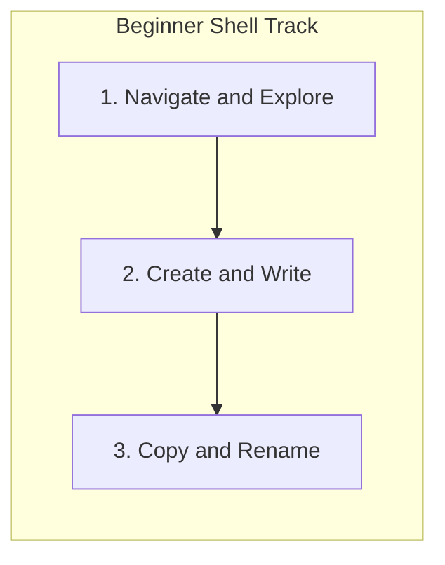

# Cortex Learning Missions System

This document specifies the architecture, data schemas, and tracks for the **Cortex Learning Missions System**. The system enables the terminal to act as an automated laboratory instructor, validating learner actions programmatically against expected criteria without manual grading.

---

## 1. Mission Data Schema

Every guided mission is represented by a JSON configuration that define steps, hints, and the verification checks.

```json
{
  "id": "git_init_commit",
  "title": "Your First Commit",
  "difficulty": "Beginner",
  "track": "Git Basics",
  "steps": [
    {
      "stepIndex": 1,
      "instruction": "Initialize a new Git repository in the current folder.",
      "placeholderText": "git init",
      "expectedPattern": "^git\\s+init",
      "validationType": "git_initialized",

      "hints": [
        "Use the 'git' command with the 'init' subcommand.",
        "Type: git init"
      ]
    },
    {
      "stepIndex": 2,
      "instruction": "Create a file named README.md to describe your project.",
      "placeholderText": "touch README.md",
      "expectedPattern": "^touch\\s+README\\.md",
      "validationType": "file_exists",
      "validationParam": "README.md",
      "hints": [
        "The 'touch' command creates empty files.",
        "Type: touch README.md"
      ]
    },
    {
      "stepIndex": 3,
      "instruction": "Stage README.md to prepare it for versioning.",
      "placeholderText": "git add README.md",
      "expectedPattern": "^git\\s+add\\s+(\\.|README\\.md)",
      "validationType": "git_staged",
      "validationParam": "README.md",
      "hints": [
        "Stage files using the 'git add' command.",
        "Type: git add README.md"
      ]
    },
    {
      "stepIndex": 4,
      "instruction": "Commit the staged files with the message 'Initial commit'.",
      "placeholderText": "git commit -m \"Initial commit\"",
      "expectedPattern": "^git\\s+commit\\s+-m\\s+[\"']Initial commit[\"']",
      "validationType": "git_committed",
      "validationParam": "Initial commit",
      "hints": [
        "Save snapshots with 'git commit -m \"your message\"'.",
        "Type: git commit -m \"Initial commit\""
      ]
    }
  ]
}
```

---

## 2. Programmatic Verification Engine

The terminal evaluates the session state (VFS and Git state) after each command to check if the current step has been completed successfully.

| Validation Type | Verification Logic |
| :--- | :--- |
| `directory_changed` | Checks if `currentDir` matches the target folder name. |
| `file_exists` | Checks if `virtualFS[targetPath]` exists and is of type `file`. |
| `file_contains` | Checks if `virtualFS[targetPath].content` matches a target regex pattern. |
| `git_initialized` | Evaluates if `gitState.initialized` is `true`. |
| `git_staged` | Evaluates if the file exists in `gitState.files` with status `staged`. |
| `git_committed` | Checks if `gitState.commits` contains a commit matching the specified message or file. |
| `command_executed` | Confirms the user ran a specific command with correct arguments. |

> [!NOTE]
> The verification engine runs **locally in the browser** on top of the virtual file system (VFS) and simulated Git state. No backend network requests are required to grade the command, resulting in 0ms latency feedback.

---

## 3. Core Learning Tracks

### Beginner Track: Shell Mechanics
This track builds basic CLI muscle memory, navigating folders and creating files.



* **Mission 1.1: Navigating the File System**
  1. Print current working directory path: `pwd`
  2. List the contents of the current directory: `ls`
  3. Change directory into `exercises`: `cd exercises`
* **Mission 1.2: Directory Assembly**
  1. Navigate back to workspace root: `cd ..`
  2. Create a folder called `project`: `mkdir project`
  3. Move into the new folder: `cd project`
  4. Create a new document called `README.md`: `touch README.md`

---

### Git Track: Version Control Mastery
This track helps students transition from manual backups to clean commits.

* **Mission 2.1: First Commit**
  1. Initialize version history: `git init`
  2. Create file `index.js`: `touch index.js`
  3. Stage all files: `git add .`
  4. Commit changes: `git commit -m "Initial commit"`
* **Mission 2.2: Branching Out**
  1. Check current repository status: `git status`
  2. Create and switch to a feature branch: `git checkout -b feature/login`
  3. Verify branches list: `git branch`

---

### Linux Track: System Manipulation
This track introduces advanced file system tools, searching and permission modifications.

* **Mission 3.1: File Hunting**
  1. Locate files ending in `.ts` inside workspace: `find . -name "*.ts"`
  2. Find lines matching "express" in `package.json`: `grep "express" package.json`
* **Mission 3.2: Permissions Lockdown**
  1. List file permissions details: `ls -la`
  2. Add execute permissions to `build.sh`: `chmod +x build.sh`

---

### Python Track: Script Execution
This track introduces scripting, execution runtimes, and troubleshooting.

* **Mission 4.1: Code Runtime**
  1. Create a script file: `touch hello.py`
  2. Write hello-world code to file: `echo "print('Hello World')" > hello.py`
  3. Run the python script: `python3 hello.py`
* **Mission 4.2: Program Troubleshooting**
  1. Open script in text editor: `nano hello.py`
  2. Edit file contents to support variable assignments.
  3. Rerun and analyze stdout logs.

---

## 4. UI Layout Integration

```text
┌────────────────────────────────────────────────────────┐
│ CORTEX SHELL                                         ▲ │
├────────────────────────────────────────────────────────┤
│ 🎯 MISSION: Initialize Repository                      │
│ [🟢 STEP 1/3] Run "git init"                           │
│ Hint: Type 'git init' and press Enter.                 │
├────────────────────────────────────────────────────────┤
│ lokeshgandreddy@MacBook-Pro Vidhyalaya % _             │
└────────────────────────────────────────────────────────┘
```
When a mission is active, a dedicated HUD (Heads-Up Display) banner slides down above the shell input prompt, stating the current goal, current step, and an expandable hint card to ensure learners never get stuck.
