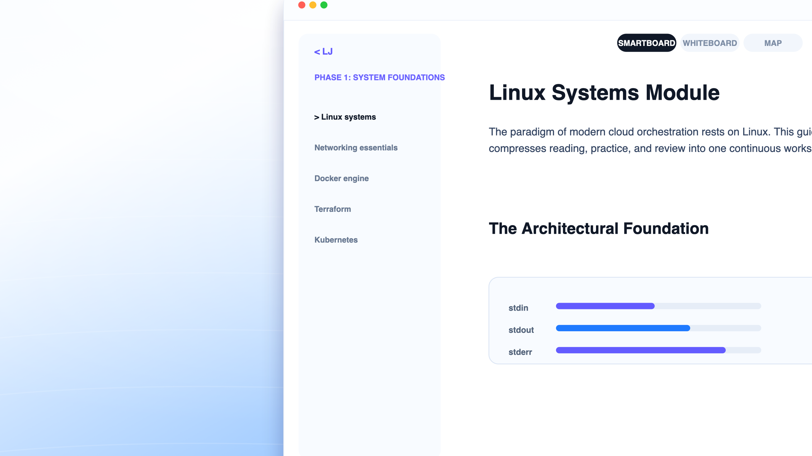

<p align="center">
  <a href="https://vidyal.ai">
    
  </a>
</p>
<p align="center"><strong>Cortex (Cortex.ai)</strong></p>
<p align="center">The open source adaptive AI orchestration engine for personalized education.</p>
<p align="center">
  <a href="https://vidyal.ai/discord"></a>
  <a href="https://www.npmjs.com/package/vidyal.ai"></a>
  <a href="https://github.com/Lokeshgandreddy81/Vidhyalaya/actions"></a>
</p>

<p align="center">
  <a href="README.md">English</a> |
  <a href="README.zh.md">简体中文</a> |
  <a href="README.ja.md">日本語</a> |
  <a href="README.es.md">Español</a> |
  <a href="README.fr.md">Français</a> |
  <a href="README.de.md">Deutsch</a>
</p>

[](https://vidyal.ai)

---

### Installation

```bash
# YOLO
curl -fsSL https://vidyal.ai/install | bash

# Package managers
npm i -g vidyal.ai-server@latest    # install backend globally
docker compose up -d                # run full stack locally with Compose
```

---

### Features

*   **Adaptive Curriculum Generation**: Input any learning goal, syllabus, or PDF. Google Gemini constructs formatted modules, prerequisites, and learning dependencies automatically.
*   **Neural Graph Synthesizer**: Visualizes subject paths as interactive D3.js concept maps, tracing prerequisites and course milestones in real-time.
*   **Cortex Sandbox & Terminal HUD**: An in-browser coding runner for JavaScript, Python, HTML/CSS, Go, and Rust, complete with git filesystem simulation and an error debugging coach.
*   **Smartboard Media Sync**: Synchronizes YouTube playback with timeline chapters, annotation triggers, and grounded bibliography citation markers.
*   **Bring-Your-Own-Key (BYOK)**: Supports inputting Gemini, OpenAI, Anthropic, or OpenRouter keys directly inside the client to run queries serverless.
*   **Optimistic Store Unification**: Frontend state modifications render instantly via Zustand, syncing with MongoDB Atlas behind the scenes.

---

### Quick Start

Ensure you have [Node.js](https://nodejs.org/) and [MongoDB](https://www.mongodb.com/) installed, then set up your environment variables.

#### 1. Setup Environment
Create a `.env` file inside the `backend/` directory:
```env
PORT=5001
MONGODB_URI=mongodb://localhost:27017/vidhyalai
JWT_SECRET=your_jwt_secret_key_here
GEMINI_API_KEY=your_gemini_api_key_here
FRONTEND_URL=http://localhost:3000
```

#### 2. Run Locally
In separate terminals, start the backend and frontend dev servers:
```bash
# Run Express Backend (starts on Port 5001)
cd backend && npm run dev

# Run Vite Client (starts on Port 3000)
cd ../frontend && npm run dev
```

---

### Architecture Overview

Cortex separates frontend visual client states from server-side vector search databases and RAG pipelines:

```
            ┌──────────────────────────────────────────────┐
            │             Vite React Client App            │
            │  (Zustand Store + D3 Concept Maps + BYOK)    │
            └──────────────────────┬───────────────────────┘
                                   │
                         REST API Requests (JSON)
                                   ▼
            ┌──────────────────────────────────────────────┐
            │              Express API Server              │
            │   (RTR Tokens, Lockouts, Sandbox Subprocess)  │
            └──────────────┬────────────────────────┬──────┘
                           │                        │
               MongoDB Atlas Vector Store      Google Gemini API
             (Syllabus Embeddings & RAG)    (apiQueue Serial Throttle)
```

For detailed protocol instructions, see the [Architecture Manual](file:///Users/lokeshgandreddy/Vidhyalaya/ARCHITECTURE.md).

---

### Security Hardening

*   **Gated API Throttling**: All generative Gemini calls queue through `apiQueue.add()` with a strict **1.5s queue delay** and a **120s timeout** to prevent 429 rate limit exceptions.
*   **Refresh Token Rotation (RTR)**: Authentications rotate refresh tokens on every request. Token reuse triggers security locks, revoking all active sessions.
*   **Sandbox Gating**: Sandbox compiler subprocesses run inside isolated runtimes, blocking local socket calls and filesystem access to `.env` secrets.
*   **Key Encryption**: Bring-Your-Own-Key inputs are encrypted at rest using AES-256-GCM.

---

### Testing & Verification

```bash
# Run Frontend Tests (Vitest)
cd frontend && npm run test

# Run Frontend Linting (TypeScript checks)
cd frontend && npm run lint

# Run Backend Tests (Node Test Runner)
cd backend && npm test
```

---

### Contributing

Contributions are welcome! Please read the [Contributing Guide](file:///Users/lokeshgandreddy/Vidhyalaya/CONTRIBUTING.md) and [Code of Conduct](file:///Users/lokeshgandreddy/Vidhyalaya/CODE_OF_CONDUCT.md) before making pull requests.

---

### License

Distributed under the MIT License. See [LICENSE](file:///Users/lokeshgandreddy/Vidhyalaya/LICENSE) for details.

---

### Contact

Cortex Project Team - **lokeshgandreddy81@gmail.com**  
Project Link: [https://github.com/Lokeshgandreddy81/Vidhyalaya](https://github.com/Lokeshgandreddy81/Vidhyalaya)
