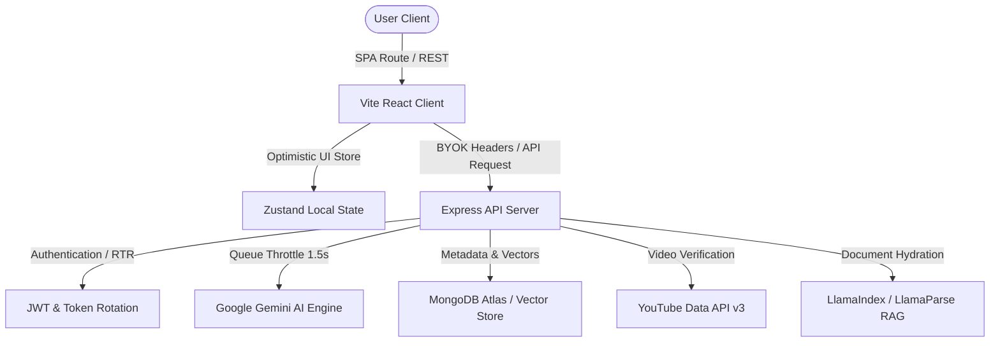

# 🎓 Vidhyalaya (Cortex.ai)

> **Adaptive orchestration engine for personalized education.** Turn unstructured link nodes, cognitive PDF payloads, syllabus documents, and learning briefs into high-fidelity academic roadmaps, interactive concept maps, and unified coding playgrounds.

---

<p align="center">
  <a href="https://opensource.org/licenses/MIT"></a>
  <a href="https://react.dev"></a>
  <a href="https://typescriptlang.org"></a>
  <a href="https://vite.dev"></a>
  <a href="https://tailwindcss.com"></a>
  <a href="https://expressjs.com"></a>
  <a href="https://mongodb.com"></a>
</p>

---

## 📸 Product Interfaces

Vidyalaya features a premium, vercel-like **Academic Modernism** design system. Our UI leverages soft kinetic physics, high-contrast surfaces, and sky-blue ice auroras for active focus.

```
┌─────────────────────────────────────────────────────────────────────────────┐
│                             Vidhyalaya Dashboard                            │
├──────────────────────┬──────────────────────────────────────────────────────┤
│ 📚 Courses & Paths   │  [ Neural Map (D3 Dependency Trees) ]               │
│ 🛠️ Code Sandbox      │  - Visualizes concept nodes and prerequisites        │
│ 📅 Study Schedule    │  - High-performance panning & zooming canvas         │
├──────────────────────┴──────────────────────────────────────────────────────┤
│ [ Whiteboard Scholarly Sheet ]     │ [ SARA AI Mentor & Practice Sandbox ]   │
│ - Detailed chapters & readings     │ - Run Javascript, Python, Go, Rust      │
│ - Verified sources & bibliographies│ - Live OTP and error coach checks       │
└─────────────────────────────────────────────────────────────────────────────┘
```

1. **Neural Synthesizer (Concept Map)**: Dynamic D3-driven dependency map visualizing subject hierarchies. Concept nodes trace prerequisites, letting learners chart educational steps visually.
2. **Immersive Study Dashboard**: The unified command deck showing active paths, calendar slots, achievements, and library folders.
3. **Smartboard Guided Media**: Synchronized YouTube video playback with integrated chapters, timeline notes, and bi-directional citation navigation.
4. **Cortex Sandbox Compiler**: Complete in-browser sandboxed playground (for JS, TS, HTML/CSS, Python, Go, and Rust) with terminal autocomplete, mock Git filesystem, and error debugging.
5. **Whiteboard Scholarly Sheet**: Focus reader mode rendering clean markdown lesson content annotated with grounded bibliographies.
6. **SARA AI Mentor Panel**: Context-aware tutoring chat, active-recall quizzes, and sync status trackers.

---

## ✨ Features

- **Generative Roadmap Engine**: Leverages Google Gemini models to orchestrate complex learning goals into modular, structured phases and topics.
- **Resource Verification & Scouting**: Pre-scouts web links and YouTube videos using background pipelines to verify metadata and prevent broken links or dead media.
- **Cortex Code Sandbox**: Execute TypeScript, Python, HTML/CSS, JavaScript, Go, and Rust code in real-time, accompanied by a simulated terminal HUD and an AI error coach.
- **Academic Grounding & Bibliography**: Automatically appends verified source indexes (`> Source: [index]`) to curriculum headings, enforcing rigorous grounding.
- **Zen Mode Focus Layer**: Switches the application to a cinematic dark mode (`bg-[#05070a]`) with custom soundscapes for distraction-free learning.
- **Bring-Your-Own-Key (BYOK)**: Supports entering custom Gemini, OpenAI, Anthropic, or OpenRouter keys locally in your browser.
- **Optimistic State Unification**: Local Zustand state updates instantly, syncing with MongoDB in the background.

---

## 🏗️ Architecture Overview

Vidyalaya is designed with a decoupled architecture. The frontend handles rendering and local code compilation, while the Express backend processes background RAG pipelines and manages persistence.



For detailed protocol instructions, see the [Architecture Manual](file:///Users/lokeshgandreddy/Vidhyalaya/ARCHITECTURE.md).

---

## 🛠️ Tech Stack

### Client-Side (Frontend)
- **Core Framework**: React v19.2.6 & TypeScript v5.8.2
- **Build Tool**: Vite v6.2.0
- **Styling**: Tailwind CSS v4.2.2 & Vanilla CSS (`index.css` gradient auroras)
- **State Management**: Zustand
- **Animations**: Framer Motion (kinetic spring physics)
- **Visualizations**: D3.js & Mermaid.js
- **Document Rendering**: `pdfjs-dist` & `react-pdf`
- **Media Integration**: `react-youtube` for synchronized playback

### Server-Side (Backend)
- **Core Framework**: Node.js & Express.js v4.18.2
- **Persistence**: MongoDB Atlas via Mongoose v8.0.0
- **RAG & Extraction**: LlamaIndex, LlamaParse
- **Security & Guards**: Refresh Token Rotation (RTR), JWT, AES-256-GCM database encryption, Helmet, Express Rate Limit, Login Lockouts
- **Logging & Monitoring**: Pino Structured Logging

---

## 🚀 Quick Start

### Prerequisites
Make sure you have the following installed:
- [Node.js](https://nodejs.org/) (v18.x or v20.x recommended)
- [MongoDB](https://www.mongodb.com/) (either running locally or a MongoDB Atlas connection string)
- [Gemini API Key](https://aistudio.google.com/) (Google AI Studio)

---

### Installation

1. **Clone the repository**:
   ```bash
   git clone https://github.com/Lokeshgandreddy81/Vidhyalaya.git
   cd Vidhyalaya
   ```

2. **Install Frontend dependencies**:
   ```bash
   cd frontend
   npm install
   ```

3. **Install Backend dependencies**:
   ```bash
   cd ../backend
   npm install
   ```

---

### Environment Setup

Create a `.env` file in the `backend/` directory:
```env
PORT=5001
NODE_ENV=development
MONGODB_URI=mongodb+srv://<user>:<password>@cluster.mongodb.net/vidyal-ai
JWT_SECRET=your_jwt_secret_key_here
GEMINI_API_KEY=your_gemini_api_key_here
FRONTEND_URL=http://localhost:3000
YOUTUBE_API_KEY=your_youtube_data_api_key_here
LLAMAPARSE_API_KEY=your_llamacloud_key_here # Optional (for PDF RAG)
EMAIL_FROM="Vidhyalaya <noreply@vidyal.ai>"
```

Create a `.env` file in the `frontend/` directory (Optional for BYOK default client key):
```env
VITE_API_URL=http://localhost:5001/api
# VITE_GEMINI_API_KEY=optional_default_client_key
```

---

### Running Locally

To run the application locally in development mode, open two separate terminal windows:

1. **Start the Backend Server (Port 5001)**:
   ```bash
   cd backend
   npm run dev
   ```
   *Note: If `MONGODB_URI` is omitted, the server will automatically launch a mock `mongodb-memory-server` in the background for setup-free development.*

2. **Start the Frontend Dev Server (Port 3000)**:
   ```bash
   cd frontend
   npm run dev
   ```
   Now navigate to `http://localhost:3000` in your web browser.

---

### Running with Docker

You can run the entire stack (Express API, React Client, and MongoDB) locally using Docker Compose:

1. Ensure your API keys are configured in your local environment:
   ```bash
   export GEMINI_API_KEY="AIzaSy..."
   ```

2. Spin up the containers:
   ```bash
   docker compose up --build
   ```
   - **Frontend App**: Accessible at `http://localhost:3000`
   - **Backend API**: Running at `http://localhost:5001`

---

## 📂 Project Structure

```
.
├── backend/
│   ├── src/
│   │   ├── config/          # DB connections & RAG configurations
│   │   ├── middleware/      # Auth gates, rate-limiters, lockout logic
│   │   ├── models/          # Mongoose Schemas (Paths, Users, Documents)
│   │   ├── routes/          # Express API controllers & routes
│   │   ├── services/        # AI orchestration, video search, worker pool
│   │   ├── utils/           # Sandbox codeRunner, logger, timing check helpers
│   │   └── workers/         # Asynchronous worker threads (e.g. PDF parser)
│   └── package.json
├── frontend/
│   ├── src/
│   │   ├── components/      # Reusable visual components & sandboxes
│   │   ├── context/         # Zustand store, Zen Mode Focus context
│   │   ├── features/        # Neural D3 Synthesizer, Smartboard video sync
│   │   ├── pages/           # Routed views (Dashboard, Courses, StudySession)
│   │   ├── services/        # API calls, local Gemini BYOK orchestrator
│   │   ├── styles/          # Custom CSS, glassmorphism templates
│   │   └── utils/           # Simulated Git, terminal HUD autocomplete
│   └── package.json
├── docs/                    # Architecture manuals & historical planning archive
└── docker-compose.yml       # Docker orchestration config
```

---

## 🧠 Core System Design

### 1. AI Architecture & Rate Throttling
- **1.5s API Queue Guard**: To respect Gemini rate limits, all prompts are queued through `apiQueue` with a strict **1.5s delay** between execution steps and a **120s timeout**. This completely eliminates HTTP 429 quota exhaustion.
- **Model Registry**: Default model dispatcher routes high-speed logical tasks, chaptering, and summaries through `gemini-1.5-flash` for zero-latency, high-performance interactions.
- **Sanitization & Healing**: Payton payloads are parsed and sanitized via `cleanContent()` and `healTables()` before rendering to protect the DOM from broken markdown nodes.

### 2. Database Optimization
- **Document Partitioning**: Detailed module content is stored separately in `ModuleContent` schemas rather than embedding it inside `LearningPath` objects. This avoids MongoDB's 16MB document size limit and scales roadmap sizes infinitely.
- **Vector Search RAG**: Uploaded materials are parsed via LlamaIndex `MarkdownNodeParser` and mapped into vector search index configurations directly on MongoDB Atlas for semantic citation querying.

---

## 🔒 Security Hardening

- **Key Encryption at Rest**: Client-supplied Gemini API keys are encrypted before database insertion using AES-256-GCM.
- **Refresh Token Rotation (RTR)**: Authenticated sessions use automated rotation tokens. Reusing a rotated token logs security alerts and revokes active access tokens to prevent replay sessions.
- **Sandbox Isolation**: The Cortex sandbox code execution engine runs inside an isolated virtual machine, blocking system sockets and filesystem calls.

---

## 🧪 Testing

### Running Frontend Tests (Vitest)
```bash
cd frontend
npm run test
```

### Running Frontend Type-Checks
```bash
cd frontend
npm run lint
```

### Running Backend Tests (Supertest)
```bash
cd backend
npm test
```

---

## 🤝 Contributing

Contributions are what make the open-source community an amazing place to learn, inspire, and create. Please read our [Contributing Guide](file:///Users/lokeshgandreddy/Vidhyalaya/CONTRIBUTING.md) and [Code of Conduct](file:///Users/lokeshgandreddy/Vidhyalaya/CODE_OF_CONDUCT.md) for details on submitting PRs.

---

## 🗺️ Roadmap

- [ ] **Spaced Repetition System (SRS)**: Flashcards and dynamic study intervals generated automatically based on lesson notes.
- [ ] **Peer Study Sessions**: Real-time collaborative neural maps using WebRTC and shared sandbox compiler sync.
- [ ] **WebAssembly Sandboxing**: Move compilers fully client-side using WebAssembly for zero-server execution overhead.
- [ ] **Interactive Voice Mode**: Native TTS and STT conversations with SARA utilizing Gemini live audio.

---

## ❓ FAQ

**Q: Do I need a paid MongoDB Atlas account?**  
*A: No, if no `MONGODB_URI` environment variable is defined, the backend will automatically spin up an in-memory database server (`mongodb-memory-server`) locally.*

**Q: What coding languages are supported inside the Cortex Sandbox?**  
*A: The sandbox compiler currently supports executing JavaScript, Python, HTML/CSS, TypeScript, Go, and Rust.*

---

## 📄 License

Distributed under the MIT License. See [LICENSE](file:///Users/lokeshgandreddy/Vidhyalaya/LICENSE) for more details.

---

## 👥 Acknowledgements

- Google Gemini Developer Relations Team
- LlamaIndex Open Source Community
- D3.js Visualization Library creators

---

## ✉️ Contact

Vidhyalaya Project Team - **support@vidyal.ai**  
Project Link: [https://github.com/Lokeshgandreddy81/Vidhyalaya](https://github.com/Lokeshgandreddy81/Vidhyalaya)
