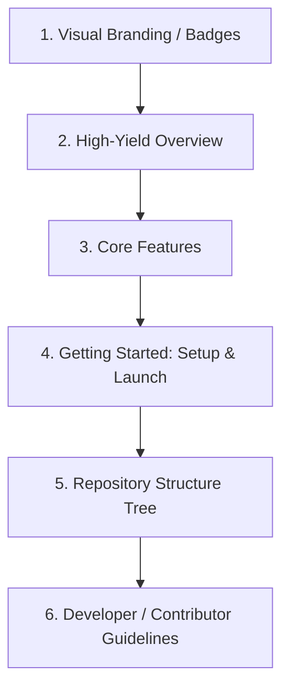

# README Best Practices Report

This report analyzes design and information hierarchy trends in world-class open-source repositories (VS Code, Next.js, React, Tailwind, Vercel) and translates them into conventions for Vidhyalaya's documentation layout.

---

## 1. Commonalities Among Elite Repository Documentation

Top-tier open-source projects structure their READMEs to immediately establish **trust**, **clarity**, and **immediate actionability**.

---

## 2. Key Insights by Project

### A. Vercel & Next.js
*   **Strengths**: Visual feature cards, minimal copy, and high-quality branding graphics.
*   **DX Strategy**: The "1-Minute Quick Start" is highlighted. Features are explained visually, keeping instructions scannable.
*   **Takeaway**: Maintain absolute simplicity in getting started instructions.

### B. React & TypeScript
*   **Strengths**: Clear explanations of project scope (e.g. "React is a library, not a framework").
*   **DX Strategy**: Comprehensive code examples showing usage, routing, and component definitions.
*   **Takeaway**: Use clear sections to clarify what the project is (and isn't) to keep contributors aligned.

### C. VS Code
*   **Strengths**: In-depth repository structure maps, build-from-source guidelines, and links to community chat (Discord/Slack).
*   **DX Strategy**: Highlighting folder layouts, boundaries, and how components interact.
*   **Takeaway**: Provide an interactive folder tree explaining directory purposes and coding rules.

---

## 3. Best Practices Framework for Vidhyalaya

To reach elite open-source standards, Vidhyalaya's README will be rewritten around these six criteria:

1. **High-Yield Hero Area**: Visual badges (React, TypeScript, Tailwind, Gemini) and a clear, descriptive subtitle summarizing the product.
2. **Visual Feature Grid**: Bulleted listings highlighting the Whiteboard, Code Sandbox, Web Audio Focus engine, and SARA AI assistant.
3. **Pristine Setup Guides**: Quick-start instructions separated by frontend and backend directories, with example environment variable files (`.env.example`).
4. **Architectural Folder Tree**: A detailed filesystem map showing where pages, features, services, and schemas live.
5. **Data Flow Sequence Diagram**: Clear visual layouts mapping state context updates to backend synchronization endpoints.
6. **Contribution Rules**: Specific links to testing commands (`npm run test`, `npm run lint`) to block unstable pull requests.
