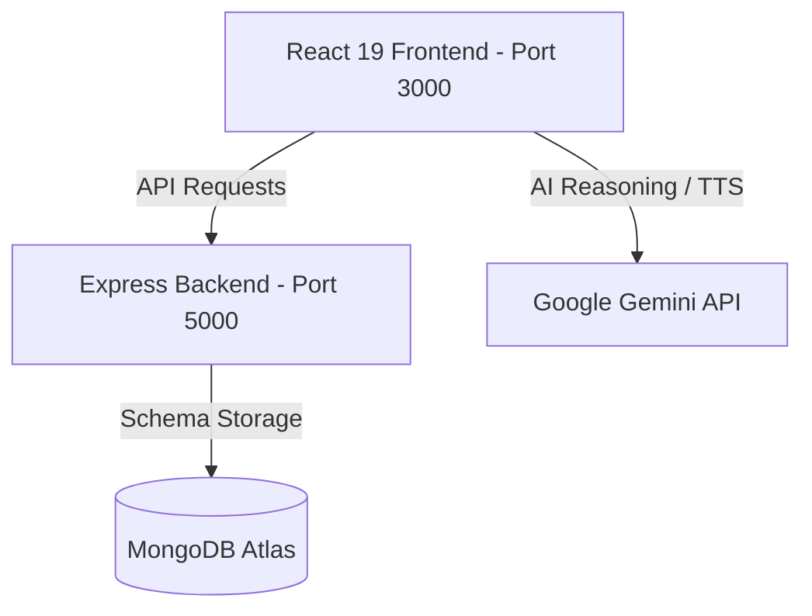
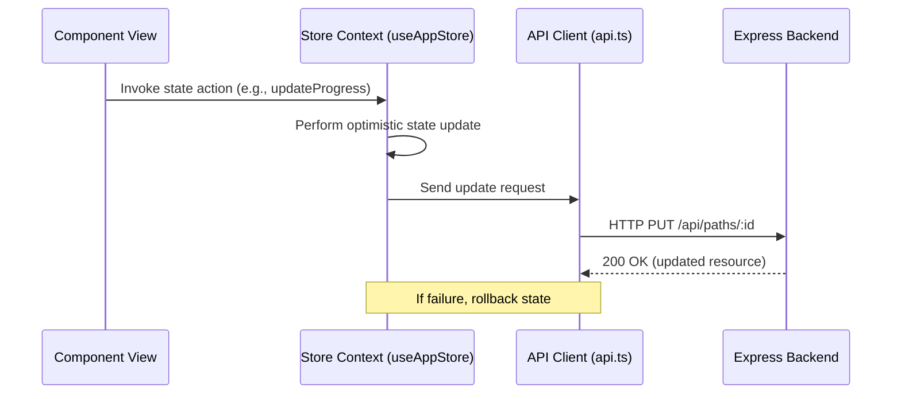

# Repository Understanding Report

This report maps the architecture, components, features, and endpoints of the **Vidhyalaya** project, serving as onboarding documentation for new engineering contributors.

---

## 1. High-Level Architecture

Vidhyalaya is a personalized education engine that structures unstructured educational content into interactive learning paths using Gemini AI. It follows a decoupled Client-Server architecture:



---

## 2. Directory Layout & Module Structure

```text
├── backend/                  # Express.js Server
│   ├── src/
│   │   ├── config/           # Database & Middleware Configurations
│   │   ├── middleware/       # Auth (JWT) & Security layers
│   │   ├── models/           # Mongoose schemas (UserProfile, LearningPath, Video)
│   │   ├── routes/           # API Endpoints (paths, auth, videos, study)
│   │   └── services/         # videoCurationService (YouTube metadata processing)
│   └── package.json
│
├── frontend/                 # React 19 Client
│   ├── src/
│   │   ├── components/       # Global UI Shell, Layouts, and Shared Elements
│   │   ├── context/          # Store.tsx (Zustand-like React Context Core)
│   │   ├── features/         # Feature-specific modules (study session, quizzes)
│   │   ├── hooks/            # Shared hooks (Focus Session, etc.)
│   │   ├── lib/              # Client utilities (Tailwind merges, formatting)
│   │   ├── pages/            # View Pages (Dashboard, Settings, Explorer, Session)
│   │   ├── portfolio/        # Public Landing & Developer CV routes
│   │   └── services/         # API (Axios client), Gemini, Soundscapes, Smartboard
│   └── package.json
```

---

## 3. Core Features & Capabilities

### A. Learning Path Wizard (`/create`)
- **Purpose**: Generates tailored structured learning maps from user descriptions or PDF uploads.
- **Service**: Handled by `geminiService.ts` utilizing `gemini-1.5-flash` to parse concepts and topics.
- **Constraints**: 10-page context limit for initial PDF parses to optimize latency.

### B. Immersive Study Environment (`/study/...`)
- **Layout**: Dynamic split-pane view containing:
  - **Whiteboard (`InteractiveWhiteboard.tsx`)**: Vector sketching and drawing canvas.
  - **Code Sandbox (`CodeSandbox.tsx`)**: Live web-based code sandbox using custom styling.
  - **Terminal (`ShellTerminal.tsx`)**: Virtualized shell console simulating commands and tracking code executions.
  - **Soundscapes (`soundscapeService.ts`)**: Background ambient sound generation using Web Audio API.

### C. SARA AI Ecosystem (`/sara`)
- **Purpose**: Intelligent coach interface including quiz validation and achievement tracking.
- **Data Model**: Managed through state profiles in `Store.tsx` and saved via `/api/users/profile`.

---

## 4. State Management Flow

Client-side state uses React Context as the source of truth, implemented in [Store.tsx](file:///Users/lokeshgandreddy/Sara/Vidhyalaya/frontend/src/context/Store.tsx). All optimistic updates and server synchronization flow through the API service:



---

## 5. Summary Evaluation

### Can a new engineer understand this repository in 15 minutes?

**Yes, with reservations.**
- **Strengths**: The directory structure follows standard feature-based React conventions (`/features` vs `/pages` vs `/components`).
- **Obstacles**:
  - `StudySession.tsx` and `NeuralSynthesizer.tsx` are monolithic components (>170KB and >70KB respectively) blending complex DOM rendering, state updates, speech synthesis, and animation logic.
  - The root directory contains a large number of temporary markdown audit logs that clutter the entry point of the project.
