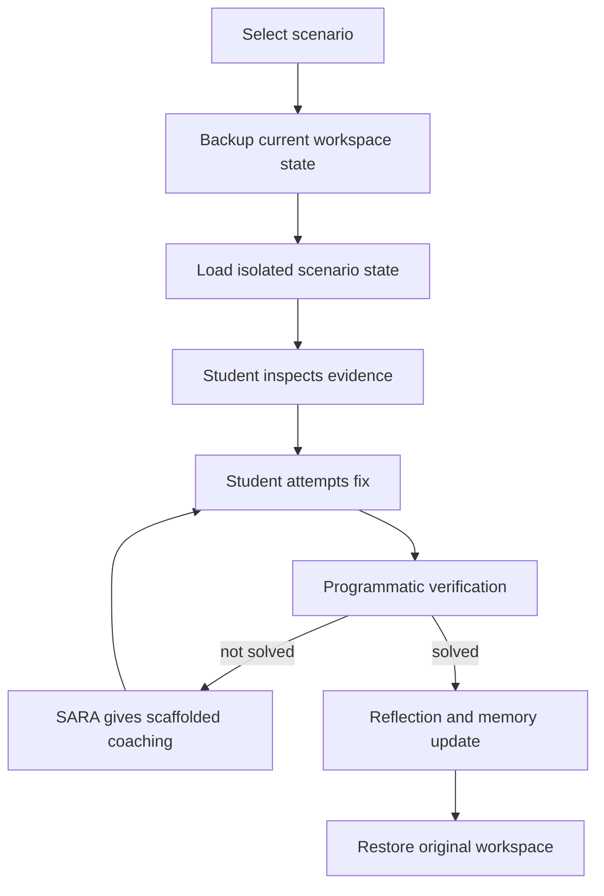

# Scenario Engine

## Purpose

The Scenario Engine teaches reality, not syntax. It places students into believable broken states where they must reason, inspect, decide, and recover.

The goal is judgment.

## Why Scenarios Matter

Tutorials teach the happy path. Engineering work is usually not the happy path.

Students need practice with:

- Production bugs.
- Broken deployments.
- Merge conflicts.
- Missing environment variables.
- Customer issues.
- Wrong assumptions.
- Partial information.

## Scenario Principles

- Safe sandbox, realistic stakes.
- Start from state, not explanation.
- Require inspection before action.
- Validate outcomes programmatically.
- Reflect on the decision process.

## Scenario Schema

```typescript
interface Scenario {
  scenarioId: string;
  title: string;
  story: string;
  role: 'developer' | 'debugger' | 'reviewer' | 'incident_responder';
  difficulty: 'Beginner' | 'Intermediate' | 'Advanced';
  estimatedMinutes: number;
  startingState: {
    files: Record<string, string>;
    git?: unknown;
    browser?: unknown;
    terminalHistory?: string[];
  };
  objectives: string[];
  constraints: string[];
  successCriteria: string[];
  reflectionPrompts: string[];
}
```

## Scenario Lifecycle



## Required Scenarios

### Broken Repo Sync

Story:

```text
Your teammate changed the server port on another branch. A merge left conflict markers in index.js. Resolve the conflict and commit the merge.
```

Teaches:

- Conflict markers.
- Reading file state.
- Editing intentionally.
- Staging as "resolved".
- Merge commit reasoning.

### Missing Environment Variable

Story:

```text
The app works locally for one teammate but fails in your environment. The API URL fallback points at the wrong server.
```

Teaches:

- Client-server boundaries.
- Environment configuration.
- Reading errors.
- Minimal safe fix.

### Broken Deployment

Story:

```text
A build passes locally but deployment fails because a dependency is missing from package.json.
```

Teaches:

- Difference between local cache and deploy environment.
- Dependency declaration.
- Reading build logs.

### Customer Issue

Story:

```text
A user reports that the checkout total updates incorrectly after removing an item.
```

Teaches:

- Reproduction.
- State inspection.
- Hypothesis-driven debugging.
- Regression check.

## Scenario UI

When a scenario is active:

- The terminal or classroom surface clearly shows sandbox mode.
- The current objective is visible.
- SARA can ask for a hypothesis before giving help.
- Exit restores the previous workspace state.

## Mentor Rules

During scenarios, SARA should not immediately explain the fix. It should ask:

- What do you observe?
- What changed?
- What do you think caused it?
- What is the smallest safe next step?

## Success Standard

A scenario succeeds when the student can:

- Fix the state.
- Explain the cause.
- Explain why the fix works.
- Name how they would prevent it next time.
