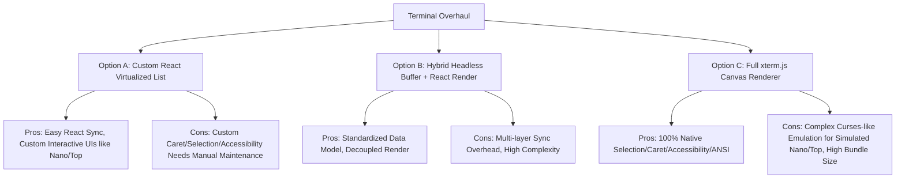

# Terminal Architecture Decision (TERMINAL_ARCHITECTURE_DECISION.md)

This document evaluates the architectural options for the terminal subsystem in Vidyal.ai to align it with elite developer standards (Cursor, VS Code, Warp).

---

### Context & Requirements
Vidyal.ai utilizes a client-side simulated terminal sandbox. Key characteristics of the environment:
1. **Interactive Simulated Applications**: Emulates real-time interactive utilities like `nano` (GNU nano text editor) and `top` (live process monitor).
2. **State Integration**: Tightly coupled with React app state (e.g. editor files, dev server port checks, compiler loading state).
3. **Pseudoshell Nature**: Feeds mock outputs and routes terminal instructions locally rather than piping commands to a real OS Pseudo-terminal (PTY) backend.

---

### Architectural Alternatives

#### Option A: Keep & Overhaul the Custom React Virtualized Terminal
* **Description**: Continue utilizing the custom virtualization list with inline cursor text-splitting and regex ANSI tag parsing.
* **Pros**:
  - **Perfect React State Sync**: Connects directly with React context and state hooks (such as file structures, dev servers, compilation overlays).
  - **Simplified Simulated UI**: Interactive utilities (like `nano` editor textareas and `top` metrics tables) can be built using standard React components instead of redrawing grid cells character-by-character.
  - **No Large Dependencies**: Keeps the bundle light and maintains zero external native dependencies.
* **Cons**:
  - Requires writing and maintaining custom behavior for complex selection drag states, keyboard selection extensions, multi-character IME inputs, and screen reader accessibility labels.
- **Complexity**: Medium.
- **Maintenance Cost**: Medium.
- **Scalability**: High for simulated workflows, Low if a true remote SSH/PTY is ever required.
- **Performance**: High (Virtual list limits viewport DOM complexity to constant $O(1)$ ~35 nodes).

#### Option B: Hybrid Headless Terminal Buffer + Custom React Render
* **Description**: Separate the data model from the UI using a headless terminal emulator core (like `xterm` headless) to process input and ANSI colors, but render the character grid via standard React div tags.
* **Pros**:
  - Offloads complex terminal state, history buffers, and ANSI/escape sequences decoding to a standardized data engine.
  - Allows drawing the terminal screen using rich HTML elements (retaining CSS flexibility).
* **Cons**:
  - High synchronization overhead bridging the external headless data model with React re-render cycles.
  - Custom UI simulation states (like interactive nano editor textareas) must still intercept keystrokes and bypass the headless core.
- **Complexity**: High.
- **Maintenance Cost**: High.
- **Scalability**: Medium.
- **Performance**: Medium.

#### Option C: Migrate to `xterm.js`
* **Description**: Integrate the industry-standard `xterm.js` package, displaying logs on a canvas-based or WebGL terminal screen.
* **Pros**:
  - **Native Fidelity**: Immediate out-of-the-box support for selection, word navigation, drag highlights, double/triple clicks, copy-paste clipboard integrations.
  - **Advanced Features**: Full ANSI color compatibility, text reflow on resize, IME compositions, and accessibility (ARIA/Screen readers) built-in.
* **Cons**:
  - **Extremely Complex Simulator Emulation**: Since `xterm.js` accepts only character/escape code streams, rendering interactive custom applications (like the mock `nano` editor and the mock `top` metrics table) would require writing a custom terminal application layer that translates cursor positioning sequences (e.g. `\x1b[H`, `\x1b[2J`) and redraws character matrices. This turns a simple React textarea edit into a terminal graphics program.
  - **Compilation Blocking**: Harder to implement the reactive compiler overlays and read-only blocking modes inline without modifying the terminal shell's input event handler layers.
- **Complexity**: Very High (Requires emulating terminal screen grid buffers for `nano` and `top`).
- **Maintenance Cost**: High (For utility translations).
- **Scalability**: High (Easy transition to real remote SSH/PTY).
- **Performance**: Elite (WebGL-rendered grid).

---

### Architectural Scoring

| Metric (Scale 1-5) | Option A (Custom React) | Option B (Hybrid) | Option C (xterm.js) |
| :--- | :---: | :---: | :---: |
| **Reliability** | 4.2 | 3.8 | **4.9** |
| **Performance** | 4.5 | 4.0 | **4.8** |
| **Maintainability** | **4.6** | 3.5 | 3.0 |
| **Developer Experience** | 4.0 | 3.8 | **4.8** |
| **Simulated Utility Support** | **4.9** | 3.8 | 2.0 |
| **Overall Score** | **4.44** | 3.78 | 3.90 |

---

### Recommendation

**We recommend Option A (Custom React Virtualized Terminal).**

**Rationale**:
Because Vidyal.ai operates in a **client-side simulated sandbox** rather than a real OS container, rendering complex interactive programs (like the simulated `nano` editor and `top` metrics monitor) is vastly simpler and more maintainable via React than trying to emulate character graphics streams in `xterm.js`.
By combining our custom virtualization wrapper, ANSI line parsed styles, and inline caret index positioning, we achieve low latency and native editing shortcuts while preserving seamless layout and state sync inside the learning dashboard.
