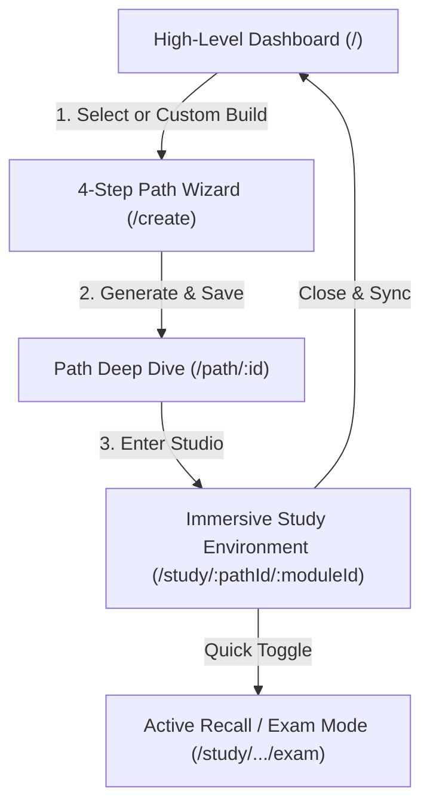

# UI/UX Specification: Vidyal.ai Immersive Learning & Smartboard

This document provides a comprehensive UI/UX specification and wireframe layout for the **Immersive Study & Smartboard Experience (`/study/...`)** in Vidyal.ai. It is designed to optimize cognitive load for busy professionals upgrading their technical skills.

---

## 1. Target User Persona: The Busy Professional
* **Profile**: Mid-level developer, technical project manager, or career switcher (ages 25–45).
* **Time Constraints**: Has 30–60 minutes of study time per day, often split into short 15-minute blocks (commuting, lunch breaks, late evenings).
* **Motivation**: Wants to acquire deep, structured mastery of complex technical domains (e.g., AI Engineering, Distributed Systems) without wading through unstructured blogs or dry documentation.
* **Core Needs**:
  - **Zero-friction onboarding**: Immediate progress resume.
  - **Bite-sized structured content**: Knowing exactly what to learn next and how it links together.
  - **Active recall & instant feedback**: Practicing immediately rather than passively reading.

### User Goals vs. Friction Points

| User Goal | Cognitive/UX Friction | Vidyal.ai Design Countermeasure |
| :--- | :--- | :--- |
| **Efficient Mastery** | Information overload from massive textbooks/docs. | **Gemini-synthesized micro-modules** capped to critical concepts. |
| **Progress Visibility** | "Where did I leave off?" and "What do I need to know first?" | **Dependency-aware linear/non-linear path maps** showing path blocking. |
| **Immediate Comprehension** | Getting stuck on dense academic text or complex code. | **Explain-on-hover tooltips** and context-aware chat. |
| **Hands-free / Multi-modal Learning** | Screen fatigue after a long workday. | **Gemini 2.5-powered Text-to-Speech (TTS)** voice companion. |

---

## 2. Information Architecture & Navigation

Vidyal.ai employs a focused, distraction-free layout with an intentional modular flow.

### Core Screen Flow


### Study Navigation Mechanics
* **Persistent Breadcrumb**: Top-left navigation allows quick egress to the parent roadmap (`/path/:id`) or the `/` dashboard.
* **Context Preservation**: Active node state, scroll depth, and reading progress are autosaved to local state and synchronized to MongoDB Atlas on unmount.

---

## 3. UI Layout Specifications: The Immersive Study Screen

The study screen uses a **3-column dashboard** structure designed for desktop-first workflows, collapsing elegantly into a linear viewport on tablet and mobile devices.

### Screen Wireframe Layout (Desktop View)

```
+-----------------------------------------------------------------------------------------------+
| [Vidyal.ai Logo] | Path: Go Backend Developer > Module: Go Concurrency          [Streak: 🔥 5] |
+-----------------------------------------------------------------------------------------------+
|  OUTLINE (250px)   |               STUDY CANVAS (Flexible Width)          |   AI COPILOT (350px)  |
|                    |                                                      |                       |
| [X] 1. Go Routines | +--------------------------------------------------+ | +-------------------+ |
|                    | | PROGRESS: [██████████████░░░] 78% (Module 1/3)   | | |  Gemini Copilot | |
| [>] 2. Channels    | +--------------------------------------------------+ | |                   | |
|     - Buffered     |                                                      | | Explain selected  | |
|     - Unbuffered   | # Channels in Go                                     | | text, or type a   | |
|                    | Channels are the pipes that connect concurrent       | | question...       | |
| [ ] 3. Select      | goroutines. You can send values from one goroutine...| |                   | |
|     - Blocking     |                                                      | | +---------------+ | |
|     - Non-blocking | ```go                                                | | | Ask a Question| | |
|                    | ch := make(chan int) // Unbuffered channel           | | | [           ] | | |
| [ ] 4. Sync Package| ```                                                  | | +---------------+ | |
|                    |                                                      | |                   | |
|                    | *Hover over code to inspect memory model*            | | Quick Actions:    | |
|                    |                                                      | | [?] Ask for Quiz  | |
|                    | +--------------------------------------------------+ | | [!] Summarize     | |
|                    | | [<< Prev Module]              [Mark Complete >>] | | [D] Code Sandbox  | |
|                    | +--------------------------------------------------+ | +-------------------+ |
+-----------------------------------------------------------------------------------------------+
| [Speaker Icon] Play Audio Synthesis (Gemini 2.5 TTS)                       [Status: Connected] |
+-----------------------------------------------------------------------------------------------+
```

### Key UI Components & Placement

#### A. Interactive Outline (Left Panel - Width: 250px, Collapsible)
* **Visual Treatment**: Slate backdrop (`#fafbfc` / Dark theme: `#090a0f`) with subtle borders.
* **States**:
  - `Completed`: Green checkmark icon, muted gray text.
  - `Active`: Focus border (`#4e5bff`), bold text, left accent strip indicator.
  - `Locked`: Padlock icon, semi-transparent text, displays tooltip indicating required parent module (`dependsOnModuleIds`).
* **Interactions**: Clicking a module changes the browser route and loads content.

#### B. Main Study Canvas (Center Panel - Flexible Width, Reading-focused)
* **Max Text Width**: Capped at `720px` to optimize line length for maximum readability (approx. 70-80 characters per line).
* **Typography**: Highly legible sans-serif hierarchy using **Outfit** for headers and **Inter** for body text.
* **Component - TTS Controller (Floating Action Bar)**:
  - **Location**: Floats bottom center of the canvas viewport.
  - **Controls**: Play/Pause, Speed multiplier (1x, 1.25x, 1.5x, 2x), and Voice profile selection (Gemini TTS).
  - **Micro-animation**: Pulsing audio waves indicator when reading active paragraphs.
* **Component - Text Explain-on-Hover / Selection popover**:
  - **Location**: Appears contextually above highlighted text.
  - **Action**: One-click lookup triggers immediate sidebar definition fetch.

#### C. AI Assistant Panel (Right Panel - Width: 350px, Collapsible)
* **Visual Treatment**: Glassmorphism panel with background blur (`backdrop-filter: blur(12px)`) and fine border (`border: 1px solid rgba(255,255,255,0.08)`).
* **Component - Action Strip**:
  - **"Grill Me" Button**: Triggers active recall mode for the active subtopic.
  - **"Visualize Architecture"**: Compiles custom Mermaids to help spatial learners.

---

## 4. Color System & Typography Scale

To create a **trustworthy, energetic, and highly-focused** studying environment, Vidyal.ai utilizes a deep, modern palette representing intelligence, precision, and energy.

### Color Palette

| Name | Hex Value | Purpose | Emotional Resonance |
| :--- | :--- | :--- | :--- |
| **Cortex Blue** (Primary) | `#4e5bff` | Primary buttons, active state indicators, wizard accents. | Innovation, depth, intelligence. |
| **Slate Dark** (Base Background) | `#0b0f19` | Main layout shell background. | Focus, modernism, low eye-strain. |
| **Canvas White** | `#ffffff` | Foreground reading plates, modals, text cards. | Clarity, clean slate, academic precision.|
| **Glow Emerald** | `#10b981` | Completed marks, streak count, success triggers. | Progress, reward, forward motion. |
| **Amber Warning** | `#f59e0b` | Dependency warnings, quiz hint alerts. | Active attention, helpful intervention.|

### Typography Scale (using Google Fonts: Inter & Outfit)

```css
/* Base system font configuration */
--font-sans: 'Inter', system-ui, -apple-system, sans-serif;
--font-display: 'Outfit', var(--font-sans);

/* Typographical hierarchy */
h1.jawdropping-header-title {
  font-family: var(--font-display);
  font-size: 32px;
  font-weight: 800;
  letter-spacing: -0.02em;
  line-height: 1.15;
}

h2.section-label {
  font-family: var(--font-display);
  font-size: 11px;
  font-weight: 700;
  text-transform: uppercase;
  letter-spacing: 0.08em;
  color: #4e5bff;
}

h3.app-h3 {
  font-family: var(--font-display);
  font-size: 18px;
  font-weight: 600;
  letter-spacing: -0.01em;
}

p.body-reading {
  font-family: var(--font-sans);
  font-size: 15px;
  line-height: 1.6;
  color: #374151; /* Dark theme option: #cbd5e1 */
}

code.inline-code {
  font-family: Menlo, Monaco, Consolas, monospace;
  font-size: 13px;
  background: rgba(78, 91, 255, 0.06);
  padding: 2px 6px;
  border-radius: 4px;
}
```

---

## 5. Actionable Design & UX Recommendations

1. **Avoid Text Wall Fatigue**:
   - Never render more than 3 consecutive paragraphs of text without breaking them up with an interactive checklist, a code block, or a key takeaway highlight card.
2. **Optimize PDF Conversions**:
   - Limit initial PDF parse payloads to 10 pages maximum (as dictated by latency standards). If a user imports a larger PDF, display a visual selector allowing them to select target chapters/sections to parse.
3. **Respect Gemini API Limits**:
   - All explain/quiz actions in the study view must queue calls with a minimum spacing of `1.5 seconds` to avoid context quota failures. Show a subtle skeleton loading animation in the assistant sidebar while awaiting answers.
4. **Optimistic Updates**:
   - When marking a module completed, immediately run the transition animations (turning outline icon green, updating progress meter) on the client side before receiving the confirmation call from Express.
