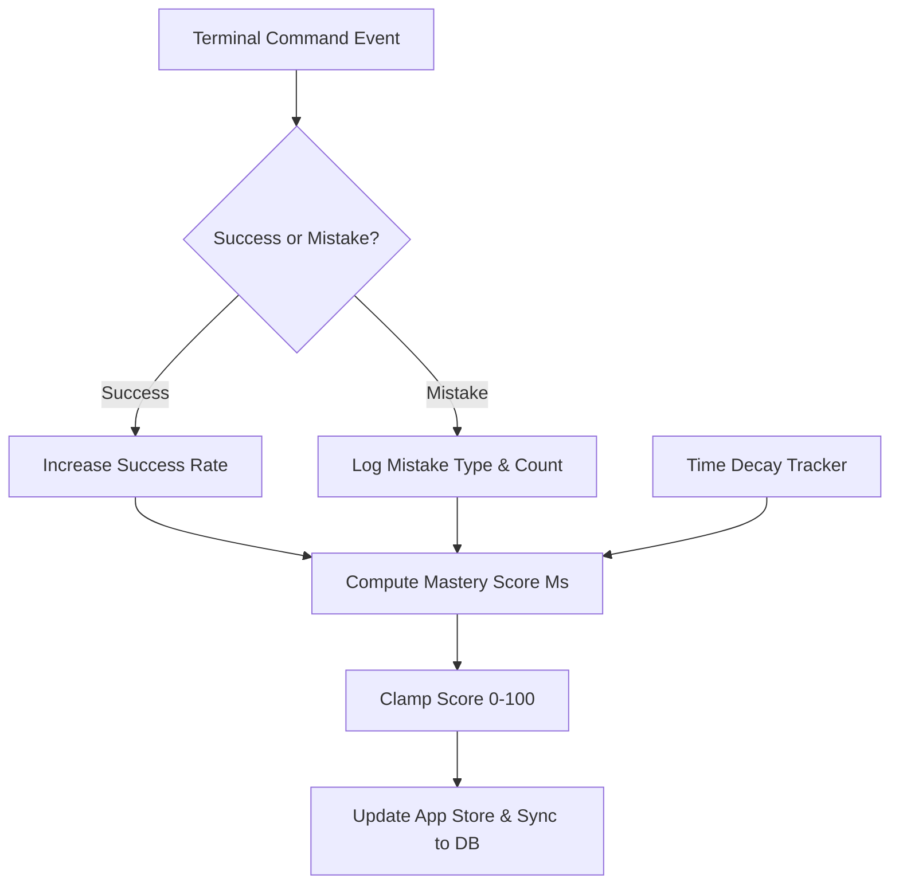

# Cortex Skill Tracking System

This document specifies the architecture, math engines, and data schemas for the **Cortex Skill Tracking System**. This system measures, updates, and persists a learner's granular technical competencies as they execute commands and complete missions in the Cortex Terminal.

---

## 1. Skill Taxonomy & Categories

The system models competence across six core tracks, each broken down into specific operational sub-skills.

| Skill Category | Sub-Skills tracked | Terminal Indicators |
| :--- | :--- | :--- |
| **Git Version Control** | Branching, Staging, Conflict Resolution, Commit Hygiene, History Nav | `git commit`, `git checkout`, `git merge`, `git log` |
| **Linux Commands & CLI**| File Navigation, Stream Redirection, Process Control, File Permissions | `cd`, `ls -la`, `cat`, `grep`, `chmod`, `find`, `|`, `>` |
| **Python Execution** | Script Running, Syntax Debugging, Dependency Exec, Environment Setup | `python3`, `pip install`, interpreter errors |
| **AI Tools (SARA)** | Co-pilot queries, Intent articulation, Context injection | SARA calls, explanation queries, request helper |
| **Problem Solving** | Typo recovery, Error interpretation, Mission pacing | Command speed, trial-and-error count, prompt use |

---

## 2. Mastery Math Engine

To compute a learner's mastery level in a skill category, the tracking system uses a multi-factor formula. This ensures that simple repetition does not inflate mastery, while penalties are applied for repetitive mistakes.

### Formula for Skill Mastery ($M_s$)

The mastery score $M_s$ for a skill category $s$ (scaled from 0 to 100) is calculated as:

$$M_s = \max\left(0, \min\left(100, \left(W_{base} \cdot R_{success} + W_{retries} \cdot \bar{A}_{retry} - P_{mistake} \cdot E_{recur}\right) \cdot F_{decay}\right)\right)$$

Where:
* **$R_{success}$ (Success Rate)**: Ratio of successfully validated steps to total attempts.
* **$\bar{A}_{retry}$ (Average Retries)**: Average number of commands executed before completing a step (lower is better).
* **$E_{recur}$ (Mistake Recurrence)**: Count of identical intercepted conceptual mistakes.
* **$F_{decay}$ (Time-Decay Factor)**: Computes skill decay over days of inactivity: $F_{decay} = e^{-\lambda \cdot t_{idle}}$ (where $\lambda = 0.05$ and $t_{idle}$ is days since last category activity).



---

## 3. Data Schemas

Skill profiles are maintained in React State (`Store.tsx`) and synchronized with MongoDB via the Express API.

### React / TypeScript Schema

```typescript
export interface SubSkill {
  id: string;
  name: string;
  score: number;        // 0 to 100
  attempts: number;
  successes: number;
}

export interface SkillCategory {
  id: string;
  name: string;
  overallScore: number; // calculated via math engine
  subSkills: Record<string, SubSkill>;
  lastActive: string;   // ISO Date string
  mistakeCounts: Record<string, number>; // Maps mistake IDs to count
}

export type SkillProfile = Record<string, SkillCategory>;
```

### MongoDB Database Document Schema

```json
{
  "_id": "647a5f8b9e6a7c001f3e7a12",
  "userId": "usr_cortex_9821",
  "updatedAt": "2026-06-03T11:50:00Z",
  "skills": {
    "git": {
      "overallScore": 76.5,
      "lastActive": "2026-06-03T10:15:24Z",
      "subSkills": {
        "branching": { "score": 85, "attempts": 12, "successes": 10 },
        "staging": { "score": 90, "attempts": 20, "successes": 19 },
        "conflicts": { "score": 45, "attempts": 8, "successes": 3 }
      },
      "mistakeCounts": {
        "git_push_uncommitted": 4,
        "git_checkout_dirty": 2
      }
    },
    "linux": {
      "overallScore": 62.0,
      "lastActive": "2026-06-02T16:44:12Z",
      "subSkills": {
        "navigation": { "score": 88, "attempts": 45, "successes": 42 },
        "permissions": { "score": 30, "attempts": 5, "successes": 1 }
      },
      "mistakeCounts": {
        "cd_into_file": 3
      }
    }
  }
}
```

---

## 4. Competence Thresholds & Progression

Learners advance through four clear bands of competency based on their computed scores:

```text
  0% ────────── [NOVICE] ────────── 35% ────────── [PRACTITIONER] ────────── 70% ────────── [PROFICIENT] ────────── 90% ────────── [MASTER] ────────── 100%
```

* **Novice (0% - 34%)**
  * *Characteristics*: High typo rate, heavily relies on hints, confuses files with directories.
  * *System Treatment*: Provides Level 3 (complete formula) scaffolding immediately; high UI helper visibility.
* **Practitioner (35% - 69%)**
  * *Characteristics*: Basic commands run successfully; struggles with multi-stage processes (like Git workflows or stream piping).
  * *System Treatment*: Offers Level 2 (functional analogies) hints; prompts self-correction before giving code formulas.
* **Proficient (70% - 89%)**
  * *Characteristics*: Fluid terminal operation; solves complex tasks independently; low error rate.
  * *System Treatment*: Displays Level 1 (gentle sparks) hints; hides standard help popups to promote discovery.
* **Master (90% - 100%)**
  * *Characteristics*: Near-zero syntax mistakes; optimizes operations (e.g. chaining CLI tools); solves simulated edge-case failures.
  * *System Treatment*: Enables developer mode, disables standard safety messages unless overridden, triggers complex "Chaos engineering" scenarios.

> [!TIP]
> Use these thresholds to filter command suggestion logs and adapt help message complexity. A Novice needs the direct formula (`git commit -m "msg"`), whereas a Proficient learner only needs a nudge (`"Check your working tree status"`).

---

## 5. UI Integration

To keep learners motivated without overwhelming them with data, the Skill Profile is visualized in two primary spaces:

1. **Dashboard Overview**: A Radar Chart rendered via SVG/CSS representing the 6 core categories.
2. **Terminal Overlay**: In the top-right corner of the terminal window, a mini skill status indicator shows the active category level (e.g., `Git: Practitioner [|||||   ] 65%`) which pulses when mastery updates.

All changes are updated on-the-fly and persisted locally. Any updates are written back using the standard client api:
* [api.ts](file:///Users/lokeshgandreddy/Sara/Vidhyalaya/frontend/src/services/api.ts) updates MongoDB.
* [Store.tsx](file:///Users/lokeshgandreddy/Sara/Vidhyalaya/frontend/src/context/Store.tsx) handles local application state.
